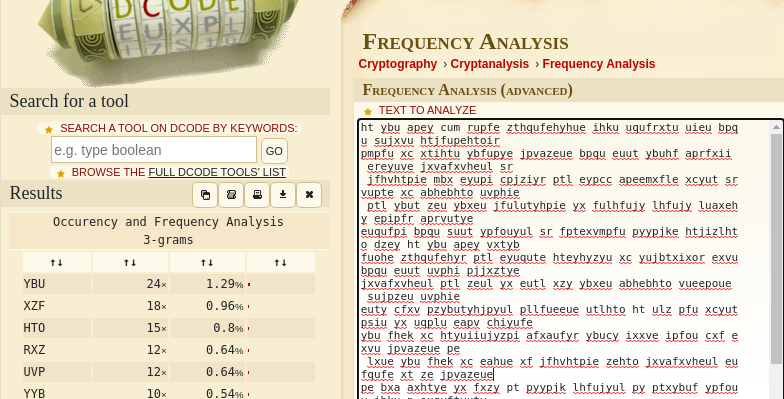
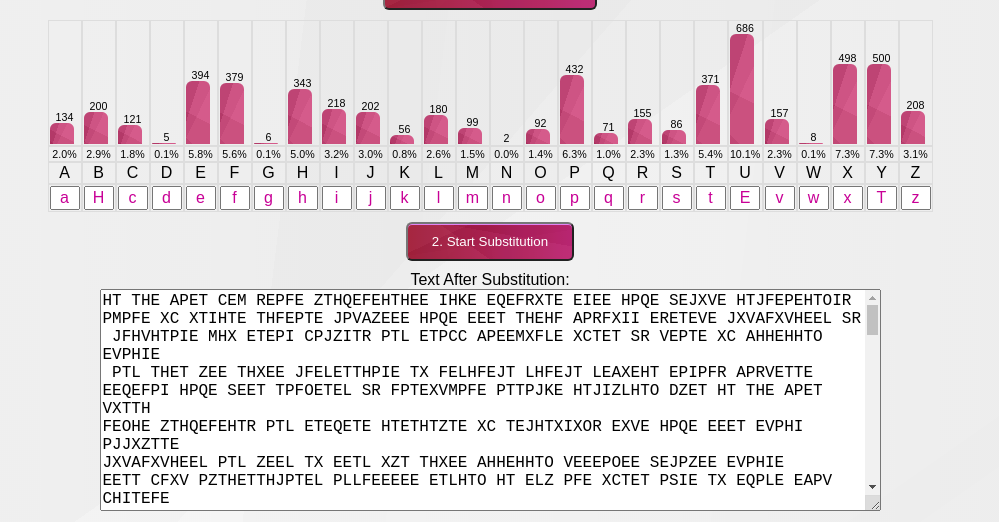
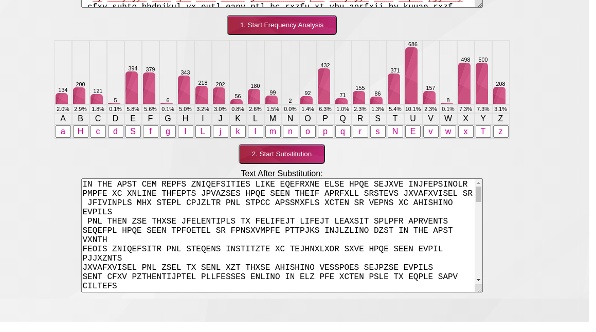

<p align="center">
    Introduction to Cryptography <br/>
    By Patrick O'Connor <br/>
    v75j556 <br/>
    CSCI 476 - Spring 2021 <br/>

</p>

# Table of Contents
- [ About this project ](#desc)
	- [ File Structure ](#struct)
- [ Task Answers ](#tasks)
- [Contact](#contact)
	- <a href= "mailto: p.oconnormsu@gmail.com?subject= Cryptography OConnor"> Click here to send email</a>

<a name="desc"></a>
# About this project
This assignment is meant to be a fun, low stakes way to introduce you to cryptography. For this assignment we’d like you to work through the following questions. Please make sure your submission is organized and easy to follow. Your responses should be clear and concise.

Started: March 27, 2021
\
Last Updated: March 30, 2021
\
Due Date: March 30, 2021

<a name="struct"></a>
# File Structure
- crypto
	- README.md
  - images
    - crypto-dcode.png
    - crypto-the.png
    - crpto-larger.png


<a name="tasks"></a>
#   Task 1: Reflection
After watching the videos linked from the course schedule, please write a brief reflection on cryptography.
\
Focus on the following topics
- What is cryptography?
- What problem(s) does it solve?
- What potential issues are there in using and designing cryptography?
- What are some of the big, important ideas in cryptography?


Cryptography is simply put the scrabbling of a message or data that once at the presumably correct user is then converted back to the original form in order to display this message or data to the only the presumably correct recipient. Cryptography has been traced back to the ancient Egyptians and with this long lineage many devices and approaches have been created but all modern ones have a few major problems that they aim to solve. These problems include authentication(identity verification), confidentiality(authorized use only), integrity(Data is not changed, destroyed, or lost), more recently becoming large non-repudiation(Proof that a party participated in an action or statement). These have been the main points of attraction and focus of cryptography for quite some time and like many security system there is a constant cat and mouse game. This cat and mouse game has led to the emergence of many potential issues to using and designing cryptography. Some of the common issues with using cryptography are key management and a more complicated access to data. Key management is more on the designing side of things but is still a problem for users as keys can be changed or misplaced and cause a loss in time for the user. This leads into the issue of more complicated access. Although it is sometimes necessary encryption can lead to a larger complexity in access this information. As a designer there are some other prominent issues for cryptographic systems including certification revocation and the ideology that cryptography guards against all attackers. Certification can be a challenging issue in designing/implementing a cryptographic system as one day a certificate can be valid and the next day it is not. Along with considering this, a designer should not rely solely on cryptography to guard its system from attackers as there is a multitude of attacks that can be presented. As a whole the designing and use of cryptography will cost more in resources such as time and money. After analyzing the resources given and using my background knowledge, the main big, important ideas in cryptography are that there does not exist at this time an unbreakable cryptography as with enough data, the rules used to encode the data will show up with enough examination and also that cryptography is only a small part of creating secure systems. There is an abundance of attacks that will either break the information system or deny services to users deeming the cryptographic system implementation useless.


#   Task 2: Substitution Ciphers & Frequency Analysis
It is well-known that monoalphabetic substitution cipher (also known as monoalphabetic cipher) is not secure, because it can be subjected to frequency analysis. In this lab, you are given a ciphertext that is encrypted using a monoalphabetic cipher; namely, each letter in the original text is replaced by another letter, where the replacement does not vary (i.e., a letter is always replaced by the same letter during the encryption).

Find out the original text using frequency analysis.

Using frequency analysis I was slowly able to find some of the common combinations
that are most commonly used in english writing. The first combination that I saw
and moved forward with was ```ybu```. This initial investigation and guess ended
up having a bountiful reward and was a great starting point. As seen below I utilized both of the linked frequency counters. I liked the frequency counter options on ```https://www.dcode.fr/frequency-analysis``` more but also found the substitution option on ```https://www.101computing.net/frequency-analysis/```
to be quite hand and simple.



As seen in the screen shot below I slowly worked my way guessing and checking based
on the more frequent and smaller words at first. Once some of those were decrypted
I was able to move to larger and more profitable words that would decrypt larger
portions of the text.




The final text that I was able to decrypt was,

```
IN THE PAST FEW YEARS UNIVERSITIES LIKE EVERYONE ELSE HAVE BECOME INCREASINGLY
AWARE OF ONLINE THREATS CAMPUSES HAVE SEEN THEIR PAYROLL SYSTEMS COMPROMISED BY
 CRIMINALS WHO STEAL FACULTY AND STAFF PASSWORDS OFTEN BY MEANS OF PHISHING EMAILS
 AND THEN USE THOSE CREDENTIALS TO REDIRECT DIRECT DEPOSIT SALARY PAYMENTS
SEVERAL HAVE BEEN TARGETED BY RANSOMWARE ATTACKS INCLUDING JUST IN THE PAST MONTH
REGIS UNIVERSITY AND STEVENS INSTITUTE OF TECHNOLOGY SOME HAVE SEEN EMAIL ACCOUNTS
COMPROMISED AND USED TO SEND OUT THOSE PHISHING MESSAGES BECAUSE EMAILS
SENT FROM AUTHENTICATED ADDRESSES ENDING IN EDU ARE OFTEN ABLE TO EVADE SPAM FILTERS
THE RISK OF INTELLECTUAL PROPERTY THEFT LOOMS LARGE FOR SOME CAMPUSES AS
 DOES THE RISK OF SPIES OR CRIMINALS USING COMPROMISED SERVERS ON US CAMPUSES
AS HOP POINTS TO ROUT AN ATTACK DIRECTED AT ANOTHER TARGET LIKE A GOVERNMENT
AGENCY OR PRIVATE COMPANY

ONE TRAINING ASKED RESPONDENTS WHAT THE BEST METAPHOR FOR A FIREWALL WOULD BE I
F THAT FIREWALL WERE A PERSON SO ITS VERY MUCH TO THEIR CREDIT THAT SO MANY SCHOOLS
HAVE INVESTED IN SECURITY MEASURES LIKE TWO FACTOR AUTHENTICATION AUTOMAT
ED BACKUPS OF SCHOOL SYSTEMS AND TRAINING MODULES TO EDUCATE THEIR CAMPUS COMMUNITIES
ABOUT THE RISKS OF PHISHING MALWARE AND WEAK PASSWORDS BUT HAVING SAT
THROUGH FAR MORE THAN MY SHARE OF THESE TRAININGS I AM CONSISTENTLY SURPRISED B
Y HOW MUCH THEY SEEM TO SKIP OVER A FEW ESSENTIAL USEFUL NONOBVIOUS POINTS ABOUT
CYBERSECURITY

FOR INSTANCE ONE TRAINING HAD EIGHT MULTIPLE CHOICE QUESTIONS ONE OF WHICH ASKED PARTICIPANTS TO IDENTIFY SOMETHING THAT WAS NOT A REASON FOR THEM TO UNDERSTAND
WHY CYBERSECURITY IS IMPORTANT THE CORRECT ANSWER ATTACKERS LOVE IT WHEN POTENTIAL
VICTIMS UNDERSTAND HOW TO DEFEND THEMSELVES ANOTHER QUESTION ASKED WHETHER
THE STATEMENT I SHOULD USE THE SAME PASSWORD FOR EVERY ACCOUNT WAS TRUE
OR FALSE ANOTHER TRAINING AT A DIFFERENT SCHOOL ASKED RESPONDENTS WHAT THE BEST
METAPHOR FOR A FIREWALL WOULD BE IF THAT FIREWALL WERE A PERSON
CORRECT ANSWER SOMEONE IN THE WORKPLACE WHO STRICTLY ENFORCES ALL RULES AND POLICIES IF
 YOURE GOING TO IMPART EIGHT PIECES OF WISDOM TO EVERYONE AT THE START OF THE SCHOOL YEAR
 THESE ARE NOT THE ONES I WOULD CHOOSE

HERE ARE THE THINGS I THINK EVERYONE ON A COLLEGE CAMPUS SHOULD KNOW FOR THE NEW
 SCHOOL YEAR

STOP COMPLAINING ABOUT NEEDING TO LOG IN TO YOUR EMAIL AND YOUR VIRTUAL PRIVATE
NETWORK WITH TWO FACTOR AUTHENTICATION ACCORDING TO A NEW REPORT FROM MICROSOFT
 IT HELPS PREVENT MORE THAN  PERCENT OF ATTEMPTED ACCOUNT COMPROMISES THAT MEANS
  IT PROTECTS YOUR VPN FROM BEING COMPROMISED AND PROTECTS YOUR EMAIL ACCOUNT
 FROM BEING HIJACKED TO SEND SPAM AND IF YOURE ON THE PAYROLL IT KEEPS YOUR
PAYCHECK SAFE IF ITS ALSO REQUIRED TO ACCESS LIBRARY DATABASES OR COURSE MANAGEMENT
WEBSITES THATS PROBABLY BECAUSE ADMINISTRATORS ARE CONCERNED ABOUT PROTECTING
COPYRIGHTED MATERIALS STORED ON THOSE NETWORKS THATS A VALID CONCERN BUT I
PERSONALLY WOULD PREFER TO PUT AS FEW BARRIERS AS POSSIBLE BETWEEN MY STUDENTS
AND THE ASSIGNED READINGS SO ILL PERMIT SOME COMPLAINING ABOUT THESE RESTRICTIONS

USE THE VPN WHEN YOURE OFF CAMPUS OR NOT AT HOME ESPECIALLY WHEN YOURE SOMEWHERE
WITH UNSECURED WI FI OR IN A FOREIGN COUNTRY WHOSE NETWORKS YOU HAVE REASON
TO MISTRUST IF YOURE TRAVELING TO CHINA OR RUSSIA FOR WORK ASK YOUR UNIVERSITY
INFORMATION TECHNOLOGY DEPARTMENT TO PROVIDE YOU WITH A CLEAN BURNER LAPTOP TO
 USE FOR TRAVEL

DONT RESPOND TO ANY EMAILS OR PHONE CALLS ASKING YOU FOR YOUR PASSWORDS OR OTHER
LOGIN CREDENTIALS YES EVEN IF THEY HAVE YOUR UNIVERSITY LOGO AT THE TOP AND
THEY COME FROM IT SYSTEMS SUPPORT AND THE SUBJECT LINE IS URGENT ACCOUNT EXPIRATION
IF YOURE LEGITIMATELY CONCERNED THAT SOMETHING MAY BE WRONG LOOK UP
YOUR COLLEGES IT HELP DESK NUMBER AND CALL THEM AND ASK DO NOT CALL THE NUMBER
 INCLUDED IN THE EMAIL

IF YOU CLICK ON THE LINKS IN EMAILS TELLING YOU TO LOG IN TO A UNIVERSITY SYSTEM
 ALWAYS DOUBLE CHECK WHEN THE WEBPAGE LOADS THAT THE BEGINNING OF THE ADDRESS
 REALLY IS YOUR SCHOOLS DOMAIN AND THAT IT HAS ESTABLISHED A SECURE CONNECTION
 DONT FALL FOR TUTFSEDU FOR TUFTSEDU FOR INSTANCE IF YOU HAVE ANY DOUBT AT ALL ABOUT THE LINK OR CANT SEE THE FULL URL IN THE EMAIL OPEN UP A NEW BROWS
ER WINDOW AND SEARCH FOR THE RELEVANT LOGIN PAGE TO BE SURE YOURE NOT BEING MISDIRECTED

DONT OPEN ATTACHMENTS THAT YOU WERENT EXPECTING TO RECEIVE OR THAT SEEM EVEN
REMOTELY SUSPICIOUS ESPECIALLY IF THEY HAVE A FILE TYPE YOU DONT OFTEN SEE OR
EVEN DONT RECOGNIZE AT THE END OF THEIR NAMES ZIP RAR EXE JAR OR IF THEY
DONT HAVE ANY FILE TYPE EXTENSION AT ALL IF YOUR SCHOOL USES A WEB BASED
EMAIL PROGRAM LIKE G SUITE FOR EDUCATION OR OUTLOOK WEB APP YOU CAN OFTEN PREVIEW
CERTAIN TYPES OF ATTACHMENTS OR OPEN THEM AS WEBPAGES BEFORE DOWNLOADING THEM ON
TO YOUR COMPUTER

ENABLE FULL DISK ENCRYPTION ON YOUR COMPUTER THIS IS EASY TO DO FOR BOTH MAC AND WINDOWS COMPUTERS YOU SHOULD ALSO MAKE SURE IT LOCKS AND REQUIRES A PASSWORD
TO ACCESS AFTER BEING LEFT UNTOUCHED FOR FIVE MINUTES

SET UP A SYSTEM FOR ONLINE BACKUPS OF YOUR HARD DRIVE PICK A CLOUD BASED
STORAGE SYSTEM LIKE DROPBOX BOX ICLOUD GOOGLE DRIVE OR WHATEVER SERVICE YOUR
SCHOOL SUBSCRIBES TO ADDITIONALLY CHOOSE A PHYSICAL OFFLINE BACKUP SYSTEM AN
EXTERNAL HARD DRIVE OR A USB DRIVE AND SET A REMINDER ON YOUR CALENDAR TO CONNECT IT
TO YOUR COMPUTER AND BACK UP EVERYTHING YOU CARE ABOUT TO THAT AT LEAST ONCE
PER WEEK AND YES IDEALLY YOU SHOULD ENCRYPT THAT HARD DRIVE OR USB DRIVE TOO
DONT START THE SCHOOL YEAR WITHOUT FEELING CONFIDENT THAT IF YOUR LAPTOP FELL
INTO THE OCEAN WAS STOLEN OR WAS INFECTED BY RANSOMWARE YOU WOULD BE ABLE TO
START OVER FROM SCRATCH WITHOUT LOSING ANYTHING IMPORTANT YOU MAY BE CONFIDENT
YOU WOULD NEVER FALL FOR ANY MALWARE MASQUERADING AS AN EMAILED CALENDAR INVITE
THOUGH DONT GET TOO COCKY THERE WE ARE ALL FALLIBLE BUT YOUR COMPUTER IS
CONNECTED TO A LARGER CAMPUS NETWORK IMAGINE YOUR MOST GULLIBLE CO WORKER OR CLASS
MATE OR STUDENT YOUR SECURITY COULD BE IN THEIR HANDS MAKE SURE YOURE IN A
POSITION TO RECOVER FROM THEIR MISTAKES AS WELL AS YOUR OWN

NEVER PAY ONLINE EXTORTION DEMANDS IT JUST ENCOURAGES MORE RANSOMWARE ATTACKS
AND YOU MIGHT NOT GET YOUR INFORMATION BACK ANYWAY

NEVER GIVE SOMEONE REMOTE ACCESS TO YOUR COMPUTER EVEN IF THEY SAY THEYRE CALLING FROM IT EVEN IF THEY KNOW YOUR NAME AND YOUR PASSWORD AND YOUR ID NUMBER

WHENEVER YOU START TO WONDER WHETHER SOMETHING IS MAYBE A LITTLE BIT FUNNY ABOUT
 AN ONLINE MESSAGE OR PHONE CALL ITS ALWAYS BETTER TO TAKE A LITTLE MORE TIME
TO CHECK THINGS OUT BEFORE RESPONDING EVEN ESPECIALLY IF YOURE BEING TOLD THAT
 YOUR BOSS OR SOMEONE YOU LOVE HAS BEEN IN A CAR ACCIDENT AND NEEDS A GIFT CARD
IMMEDIATELY

ACTUALLY THAT LAST ONE DESERVES ITS OWN TIP ALWAYS BEWARE OF EMAILED REQUESTS
FOR GIFT CARDS
```

This overall was a fun task and I enjoyed it. Never having done much with cryptography
I was surprised multiple times and enjoyed breaking the simple decryption. I look forward to digging deeper in the following week.

# Quick-Nav
- [ About this project ](#desc)
	- [ File Structure ](#struct)
- [ Task Answers ](#tasks)

\
<a name="contact"></a>
<a href= "mailto: p.oconnormsu@gmail.com?subject= Cryptography OConnor"> Click here to send email</a>
