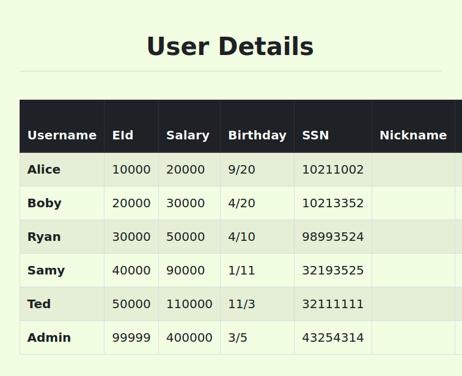
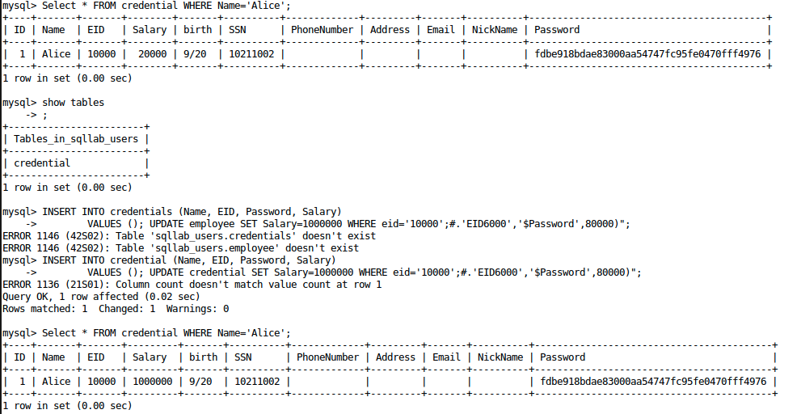

<p align="center">
    Lab 09 - Final Lab <br/>
    By Patrick O'Connor <br/>
    v75j556 <br/>
    CSCI 476 - Spring 2021 <br/>

</p>

# Table of Contents
- [ About this project ](#desc)
	- [ File Structure ](#struct)
- [ Task Answers ](#tasks)
- [Contact](#contact)
	- <a href= "mailto: p.oconnormsu@gmail.com?subject= Lab 09 OConnor"> Click here to send email</a>

<a name="desc"></a>
# About this project
The Final Lab will give you an opportunity to explore ideas we’ve covered over the course of this semester. The format of this “final” is intentionally designed to be like any other lab in this course with one caveat: The Final Lab is to be completed individually. You are allowed to use any resources available to you (VM, notes, slides, textbook, Internet, etc.), but you cannot ask someone—other than the course instructor—for help or get someone to solve the problems for you. To be clear, posting questions or responses online is not allowed (no posting on Slack, D2L, or else where). You can use Slack to direct message (DM) me if you need to ask me questions. Any work used to arrive at a solution must be shown. If an online resource was used, it must be cited. As with most of our past labs, the planned duration for the Final Lab is 1 week. (I think it should take approximately 3 hours to actually complete the final lab).


Started: April 21, 2021
\
Last Updated: April 25, 2021
\
Due Date: April 27, 2021

<a name="struct"></a>
# File Structure
- lab09
	- README.md


<a name="tasks"></a>

# Statement of Academic Honesty

I Patrick OConnor (v75j556) agree that the solutions presented below are entirely my own.
If I have used resources that are not my own, I have included appropriate citations.

#   Task 1: Short Answer

## Task 1.1:

Both system() and execve() can be used to execute external programs. Why is system() considered to be unsafe while execve() is considered to be safe?

The reason that ```system()``` is considered unsafe is that is always invokes a shell. With this shell and a bit of tinkering such as we did in our lab with creating a executable script named ```ls``` we can get a root owned shell even without having root access. While execve() does not call a shell and executes the program that is passed to it as first argument and does not return except on failure.

##  Task 1.2: 
For the Shellshock vulnerability to be exploitable, two conditions need to be satisfied. What are these two conditions?

The two conditions that need to be satisfied in order for the Shellshock vulnerability to be exploitable are that the target process should run bash and that the process must obtain some environment variable from the outside(ex. untrusted user).

## Task 1.3: 
Suppose we run
```
$ nc -l 7070
```

on Machine 1 (IP address is 10.0.2.6), and we then type the following command on Machine 2 (IP address is 10.0.2.7).

```
$ /bin/cat < /dev/tcp/10.0.2.6/7070 >&0
```

Describe what is going to happen.

Machine 1 is going to listen on port 7070 for any incoming traffic/connections. Machine two will then be reaching out to 10.0.2.6 at port 7070. We will see a connection made on made on Machine 1 with the information such as IP of 10.0.2.7.

## Task 1.4: 

What is ASLR and why does ASLR make buffer-overflow attacks more difficult?

ASLR is an acronym for Address Space Layout Randomization and it is a security function that works with virtual memory management to randomize the locations of different parts of the program.
This randomization of the virtual memory is useful in deterring buffer-overflow attacks as it makes landing the payload in the correct location in the program much harder. This essentially makes 
trial and error attack methods almost useless as a new address will be generated each time the program is executed.

## Task 1.5: 

What is the underlying cause for XSS vulnerabilities?

The underlying cause for XSS vulnerabilities is data validation. Although this is a all encompassing term most XSS vulnerabilities can be stopped quite abruptly if data is limited in what it can contain. Data validation includes ensuring that the data is not code and code is not data and whether it should be running something or only changing certain fields. This can be simply put as restricting the resources that specific pages can load.

## Task 1.6: 

What is the difference between reflected XSS and stored XSS?

The difference between stored XSS and reflected XSS is that for stored XSS there is some persistent data that is stored typically in a database while reflected XSS has non-persistent data and is only visible to those that input it in or directly access it(links or user input).

## Task 1.7:

In the Diffie-Hellman key exchange, Alice sends g^x mod p to Bob, and Bob sends g^y mod p to Alice. How do they get a common secret?

They both get the common secret through a couple different steps that will be detailed in a list as I find stepping through a list to be most descriptive.

- Given the information above we can identify that there is a a shared public prime number p and an non-zero integer g. Both of these are shared and public

- Alice then picks a secret integer x that is not shared with anyone and is used for computing g^x mod p

- Bob also picks a secret integer called y that is not shared with anyone and is used for computing g^y mod p

- Both Alice and Bob send their represented calculated g^x mod p and g^y mod p

- With this information, both parties can then compute the prime of the equation using each of their private keys and the resulting equation will be the same.
 
- As both equations with the secret integers will be the same when primed and the common secret can be discovered on both ends.


## Task 1.8:

Why do we use hybrid encryption? Why don’t we simply use public key cryptography to encrypt everything?

It is simply better to use a hybrid encryption as it allows the convenience of an asymmetric encryption scheme while maintaining the effectiveness of a symmetric encryption scheme. This is much more efficient than relying on public key cryptography as there is less computation. This computation comes from the unique manner that each key is created. Along with this public key cryptography alone is quite vulnerable to many simpler attacks like brute force and man-in-the-middle processes.

## Task 1.9:

(Part 1) When you run programs at the command line (e.g., ls, cat, top) or link to libraries (e.g., libc), how are these programs/libraries found?

This depends on what the program is for commands like cd, pwd, echo, alias the shell directly executes them. While executable programs like ls, cat,  or whoami utilize a pathname to find and load from the disk. This searching goes through multiple steps of elevation such that first if a pathname is given, the file is executed (when possible). Next if only a filename is given, sh searches in all directories specified in the variable ```$PATH```.

(Part 2) What is a potential risk of using this approach to find programs/libraries?

The potential risk in using this approach is that it is possible to change the ```$PATH``` to a different location and then create SET-UID programs that have root pivledges with a similar name to those above but have different outcomes. This was seen in lab01 in which we created a new ```ls``` command that did not return the file listing. This program could essentialy be altered to share data or allow for incoming connections or really what ever you can imagine while doing the same operation leaving the user to not know the difference but be creating a vulnerable computer.

## Task 1.10: 
Identify at least three countermeasures to buffer-overflow attacks and briefly describe how they work.

- ASLR is a standard in virtual memory allocation and is a simple at the surface counter-measure to buffer-overflow atacks. Address Space Layout Randomization works with virtual memory management to randomize the locations of different parts of the program. This randomization makes landing the attackers payload in the correct location in the program much harder. This essentially makes trial and error attack methods almost useless as a new address will be generated each time the program is executed.

- Non-executable stacks are also used frequently in order to mark an area of memory(the stack or other areas) as a place where code can not be executed. This simply means an attacker cannot inject code onto the stack as it will not be executed there.

- StackGaurd is also useful in combatting buffer-overflow attacks. Stackgaurd is most effective in stack-based buffer-overflow attacks as these attacks need to modify the return address to be effective. Stackgaurd combats these attacks by detecting when the return address is altered before returning from a funtion. This can be completed multiple ways but the simplest to explain briefly is storing a copy of the return address at some other place and checking to see if is modified.

# Task 2: Guest Visit Questions

Long Answers: These problems may warrant more elaborate responses than in Task 1, but please try to keep your responses clear and concise.


## Task 2.1: Security in the Real World: Crypto (10 points)

Please recall our class on 4/20 with a guest visit from Ryan Darnell. During this class we discussed a real-world scenario where you needed to design a feature that used an assortment of ideas we’ve learned about from cryptography to protect project files. Your primary objectives were to (1) securely store sensitive project data, while (2) trying to minimize overhead and data loss (e.g., due to partial file corruption).

Please write a brief summary of the approach you settled on, the pros/cons, and any potential challenges or issues with your approach.

My Approach to utilizing cryptography to protect project files and achieve both of the primary objectives of (1) securely store sensitive project data, while (2) trying to minimize overhead and data loss (e.g., due to partial file corruption) would be first to identify what exactly is sensitive data. This will decrease the overhead atleast when loading for titles, ids, and date of modification. After identifying what the project managers it is now time to encrypt what has been deemed sensitive. For this I have decided that asymetric block cypher (AES-CTR) of raw output to encrypt for most users while giving the option of (AES-GCM) for those that are working with data that requires data integrity. This was a choice made based on the recoverability of AES-CTR in that there will not be drops of data in this format. This approach will create complexity for developers yet I believe that it is the best approach as it provides flexibility for the project manager to satisfy the customer and this is the end goal. It is worth noting that either of these do not have as much padding as AES-CBC and will decrease the size and searchtime for opening the encrypted file. Another challenge would be created with this approach in that we must store a key for each of the files creating another complexity in that we must find a good location. I think that the approach of placing this key in the ```xml``` file is the best approach. 


## Task 2.2: Security in the Real World: Compliance (10 points)

Please recall our class on 4/22 with a guest visit from Reese Pearsall. During this class we learned about real-world work that aims to automate aspects of compliance.

Please answer the following questions:

- In your own words, what is compliance and why is compliance important?

In my own words, compliance is simply checking the boxes that consists of rules and requirements. Compliance is important as it allows for a framework to exist that ensure those who are trusted with sensitive data are in fact keeping this information secure whatever the industry is. Along with this as a corporation it is important to have solidified your protective measures to create a trusted brand with life-long customers/partners.

- What is a compliance framework?

A compliance framework is a structured set of guidelines and best practices that details the companies process to ensure that regulatory requirements are being met or exceeded. In addition, to ensuring these guidelines are met frameworks provides a common language for all areas to communicate on enhancing security and improving proccesses.

- Please provide three (3) examples of a compliance rule/test, and briefly explain why this check could be helpful towards ensuring compliance?

- A compliance rule for Ubuntu operating systems is that they must utilize address space layout randomization to protect its memory from unauthorized code execution. This can be tested quite simply with adminstrator using the command ```sudo sysctl kernel.randomize_va_space```. If this returns ```kernel.randomize_va_space = 2``` then the system is utilizing ASLR and is atleast making attacks harder for the attacker.

- Another compliance rule for Ubuntu operating systems is that the it must be configured so that the root account must be the only
account having unrestricted access to the system. This can be checked by identifying which users have a uid of 0. Using the command in bash ```awk -F: '$3 == 0 {print $1}' /etc/passwd``` will return all users of ```uid=0```. If any other account is returned by root this needs to be investigated and fixed for meeting compliance.

- Lastly for another Linux distro, the Red Hat Enterprise Linux operating system must be configured to disable USB mass storage. This can be checked by utilizing ```grep``` to identify which settings are blacklisted. The command for checking this with bash is ```grep usb-storage /etc/modprobe.d/* | grep -i "blacklist" | grep -v "^#"```. When this is ran ```blacklist usb-storage``` should be returned and if it is not, investigation is warranted and changes should be made.

Overall, monitoring the current compliance rules for any industry you are participating in is important for ensuring you have a safe system. This is also not a one time thing and should be checked frequently. Along with checking it frequently ensuring that all employees are educated on protocols will assist in making the business more secure.

# Task 3:  I Got 99 Problems But Auditing Ain’t One

Early in the semester we studied Set-UID programs and considered scenarios where Set-UID programs can be useful. We considered various examples of Set-UID programs. One example was a program to allow users to change their passwords. Another example was a program to allow users to read (but not write) any file on a system, regardless of who owns the file. In this task, we will consider the latter example (“system auditing”), and you will demonstrate your understanding of the Set-UID mechanism as well as how it can be exploited

##  Task 3.1: 
Please read the source code for audit.c and, at a high level, describe what this program does and how it works.

```c
#include <string.h>
#include <stdio.h>
#include <stdlib.h>
#include <unistd.h>

int main(int argc, char *argv[])
{
  char *v[3];
  char *command;

  if(argc < 2) {
    printf("Please type a file name.\n");
    return 1;
  }

  v[0] = "/bin/cat"; v[1] = argv[1]; v[2] = NULL;
  command = malloc(strlen(v[0]) +strlen(v[1]) + 2);
  sprintf(command, "%s %s", v[0], v[1]);
  system(command);

  return 0 ;
}
```

At a high level ```audit.c``` is taking in a file name at the command line, and then it will run ```/bin/cat``` to display the specified file. Since the program is running as a root, it can display any file the user specifies. It will then use ```system(command)``` to create a shell and then run the command. This command will return the file that is requested when used by a non-malicous user. Although as ```audit.c``` is using ```system()``` this can be exploited to pass through more than one argument to the shell.


##  Task 3.2: 
With our understanding of audit.c from the previous task, please demonstrate how it can be exploited to run an arbitrary command with elevated privileges.

For your demonstration, you’ll need to compile audit.c and make the resulting executable a privileged Set-UID program.

You are permitted to change ```/bin/sh``` to point to a shell without the ```setuid != ruid``` countermeasure.

Using the ```system()``` part of the above ```audit.c``` program it is possible to pass through more than one argument to the shell created by ```system()```. In order to do this, it is as simple as using the terminal command ```./audit "myenv2; sudo vim /etc/shadow"``` . This is effective as you are passing the entirety of ```"myenv2; sudo vim /etc/shadow"``` to the ```./audit``` program which then calls concats the input and runs it in a shell. As seen in the images below with this command above we can open a root owned folder for editing when encompassing the file in with ```sudo vim```.


##  Task 3.3: 
Suppose now that we want to fix the issue from the previous part. A sysadmin tweaks the previous audit program and instead uses the new audit2.c program. You can see that this new program uses ```execve()``` instead of ```system()```, and now it uses the ```more``` program instead of ```cat```.

Please read the manual of the ```more``` program to find out what the auditor could do to gain more privileges beyond what is intended by the sysadmin. Your task is to explain, and demonstrate, how the auditor can exploit audit2.c to do something they should not be able to do.

Again, for your demonstration, you’ll need to compile audit2.c and make the resulting executable a privileged Set-UID program.

You are permitted to change ```/bin/sh to point to a shell without the setuid != ruid countermeasure.

```c
#include <string.h>
#include <stdio.h>
#include <stdlib.h>
#include <unistd.h>

int main(int argc, char *argv[])
{
  char *v[3];
  char *command;

  if(argc < 2) {
    printf("Please type a file name.\n");
    return 1;
  }

  v[0] = "/bin/more"; v[1] = argv[1]; v[2] = NULL;
  execve(v[0], v, NULL);

  return 0 ;
}
```

Using the ```more``` manual I was able to create an idea of approach which utilizes the more option of adding a ```command``` to the program. With this I can add a command such as ```Command:n file1 file2``` with this we can open multiple files which is more than the intended from the sysadmin.

#   Task 4: Inject This…
In this task you will demonstrate your understanding of SQL Injection attacks.

In tasks 4.2 and 4.3 we ask that you not only explain your approach, but also that you demonstrate that your approach can be successful. For the purposes of this task, you may take whatever approach you like to conduct your demonstration. For example, you may modify any of the code/examples from the lab on SQL Injections, you may use the MySQL command line, etc. Whatever you do, you must explain your setup and your approach, and you must present evidence that your attack was successful.


##  Task 4.1: 
To defeat SQL injection attacks, a web application has implemented a filtering scheme on the client side: basically, on the page where users type their data, a filter is implemented using JavaScript. It removes any special character found in the data, such as apostrophes, characters for comments, and keywords reserved for SQL statements. Assume that the filtering logic does it job, and can escape/remove all the code from the data.

Is this solution able to defeat SQL injection attacks? Explain.

This solution is possibly going to stop some of the attacks although it is not a complete solution to SQL Injections Attacks. A filter should never be the only line of defense as it is possible to carefully construct an injection and bypass any filtering.


##  Task 4.2: 
The following SQL statement is sent to the database to add a new user to the database, where the content of the ```$name``` and ```$passwd``` variables are provided by the user, but the ```EID``` and ```Salary``` field are set by the system. How can a malicious employee set his/her salary to a value higher than ```80000```? Please demonstrate and explain your approach.

```
$sql = "INSERT INTO employee (Name, EID, Password, Salary)
        VALUES ('$name', 'EID6000', '$passwd', 80000)";
```

This attack on an unsecure database is a simple suffixing or concatenation of the command below into the ```$name``` or ```password``` field.
```
UPDATE employee SET Salary=1000000 WHERE eid='EID6000'
```

With this we can now craft the entie SQL statement that would look like such. The below has been edited to change Alice'salary from lab04 instead of eid6000
```
$sql = "INSERT INTO credential (Name, EID, Password, Salary)
        VALUES (); UPDATE credential SET Salary=1000000 WHERE eid='10000';#.'EID6000','$Password',80000)";
```

The end of the above statement is not essential as the ```#``` is commenting out the remainder of the SQL statement.


With this the salary of Alice is set to 1 billion dollars. As seen below this is effective 



##  Task 4.3: 
The following SQL statement is sent to the database, where ```$eid``` and ```$passwd``` contain data provided by the user. An attacker wants to try to get the database to run an arbitrary SQL statement. What should the attacker put inside ```$eid``` or ```$passwd``` to achieve that goal? Please demonstrate and explain your approach.

In this task, you can and should enable the code/database to be able to execute multiple statements.

```
$sql = "SELECT * FROM employee
        WHERE eid='$eid' and password='$passwd'";
```

With this information we can delete user Ryan from the database through the login screen by placing
```'1=1;Delete from credential where name='Ryan';# in either the username or password location.```

This will cause the SELECT statement to run, return no results. This SELECT statement ending will start the next command/statement of ```DELETE``` from the employee table where eid does not equal 1000. 

Overall this is similar to the above task 4.2 but with a minor change. I had struggled with completing this until I realized that I did not enable the code/database to be able to execute multiple statements. Once this was completed it was only a matter of plugging in the created sql statement.

# Quick-Nav
- [ About this project ](#desc)
	- [ File Structure ](#struct)
- [ Task Answers ](#tasks)

\
<a name="contact"></a>
<a href= "mailto: p.oconnormsu@gmail.com?subject= Lab 08 OConnor"> Click here to send email</a>
