<p align="center">
    Lab 06 - Secret-Key Encryption Lab <br/>
    By Patrick O'Connor <br/>
    v75j556 <br/>
    CSCI 476 - Spring 2021 <br/>

</p>

# Table of Contents
- [ About this project ](#desc)
	- [ File Structure ](#struct)
- [ Task Answers ](#tasks)
- [Contact](#contact)
	- <a href= "mailto: p.oconnormsu@gmail.com?subject= Lab 01 OConnor"> Click here to send email</a>

<a name="desc"></a>
# About this project
The learning objective of this lab is for students to get familiar with key concepts behind secret-key encryption and some common attacks on encryption. From this lab, students will gain first-hand experience in encryption algorithms, encryption modes, padding, and initialization vectors (IV). Moreover, students will learn how to use tools, and write programs, to encrypt and decrypt messages.

This lab covers the following topics:

- Secret-key encryption
- Encryption modes, IV, and padding
- Common mistakes when using encryption algorithms

Started: April 05, 2021
\
Last Updated: April 08, 2021
\
Due Date: March 06, 2021

<a name="struct"></a>
# File Structure
- lab06
	- README.md


<a name="tasks"></a>
#   Task 1: Encryption Ciphers and Modes
In this task, you will experiment with various encryption algorithms and modes.

You can use the following ```openssl``` enc command to encrypt/decrypt a file.
```
$ openssl enc -CIPHERTYPE -e -in plain.txt -out cipher.bin -K KEY -iv IV -p


# Summary of common `openssl enc` options:
# -in <file>     input file
# -out <file>    output file
# -e             encrypt
# -d             decrypt
# -K             the key (in hex format) must follow this option
# -iv            the IV (in hex format) must follow this option
# -[pP]          print the iv/key (then exit if -P)
```

Using the following inputs I was able to successfully encrypt the plain.txt file
using at least 3 different ciphers.

```
openssl enc -aes-128-cbc -e -in plain.txt -out cipher.bin -K
 4125442A472D4B6150645267556B5870 -iv 4A404E635266556A586E5A7234753778  -p
```

```
openssl enc -aes-128-cfb -e -in plain.txt -out cipher.bin -K
 792F423F4528482B4D6251655468576D -iv 2A472D4B6150645367566B5970337336 -p
```

```
openssl enc -aes-128-ofb -e -in plain.txt -out cipher.bin -K
 576D5A7134743777217A25432A462D4A -iv 4428472B4B6250645367566B59703373 -p
```

This was quite interesting to do and was surprisingly simple although  the logic behind these and the following encryption patterns is not as simple to follow.

#   Task 2: Comparing Encryption Modes
In the supplied files, ```files/pic_original.bmp``` is a simple picture in the BMP - or bitmap - file format.

We would like to encrypt this picture so that anyone without the encryption key is unable to know what the file contains.

##   Task 2.1:
In this task, you must encrypt the file using the ECB (Electronic Code Book) and CBC (Cipher Block Chaining) modes, and then do the following:

### Task 2.1.1
Since this encrypted picture is in fact a picture, please start by trying to view the encrypted picture as any other picture. Feel free to use your favorite picture viewing software. Note, however, that for a properly-formatted ```.bmp``` file, the first 54 bytes must contain the header information about the picture; because the image is in fact encrypted, we have to set the file header correctly so that the encrypted file will be recognized as a legitimate ```.bmp``` file. To achieve this, we must replace the header of the encrypted picture with that of the original picture.

To make this change we can you could, for example, use the bless hex editor tool (already installed on our VM) to directly modify binary files. (In general you are free to use any hex editor you like.) Alternatively, we can also use the following commands to extract the header from ```p1.bmp```, the body (data) from ```p2.bmp``` (starting from offset 55 to the end of the file), and then combine the header and body together into a new file (```new.bmp```).

### Task 2.1.2
Display the encrypted picture using a picture viewing program (we have installed an image viewer program called eog on the VM). Can you derive any useful information about the original picture from simply viewing the encrypted picture? Please explain your observations.
```
seed@VM:~/.../files$ openssl aes-128-cbc -in pic_original.bmp -out pic_cbc.bmp

seed@VM:~/.../files$ head -c 54 pic_original.bmp > header
seed@VM:~/.../files$ tail -c +55 pic_cbc.bmp > body
seed@VM:~/.../files$ cat header body > pic_cbc.bmp
```
```
seed@VM:~/.../files$ openssl aes-128-ecb -in pic_original.bmp -out pic1_ecb.bmp

seed@VM:~/.../files$ head -c 54 pic_original.bmp > header
seed@VM:~/.../files$ tail -c +55 pic1_ecb.bmp > body
seed@VM:~/.../files$ cat header body > pic_ecb.bmp
```
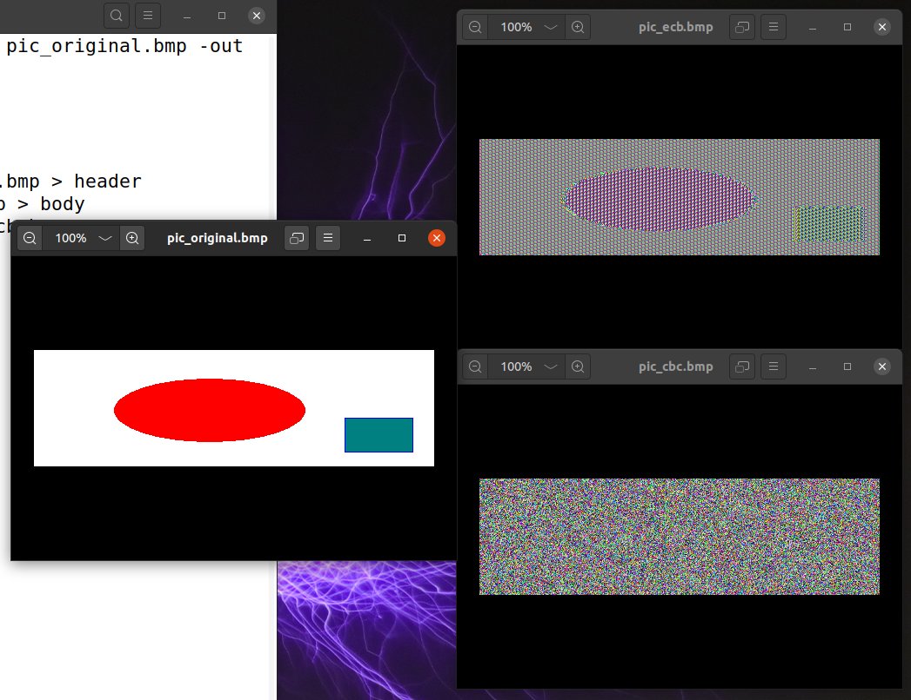
##   Task 2.2:
Now, select a picture of your choice, repeat the experiment above, and report your process and observations.
```
seed@VM:~/.../files$ openssl aes-128-ecb -in treasure.bmp -out treasure_ecb.bmp

seed@VM:~/.../files$ head -c 54 treasure.bmp > header
seed@VM:~/.../files$ tail -c +55 treasure_ecb.bmp > body
seed@VM:~/.../files$ cat header body > treasure_ecb.bmp
```

```
seed@VM:~/.../files$ openssl aes-128-cbc -in treasure.bmp -out treasure_cbc.bmp

seed@VM:~/.../files$ head -c 54 treasure.bmp > header
seed@VM:~/.../files$ tail -c +55 treasure_cbc.bmp > body
seed@VM:~/.../files$ cat header body > treasure_cbc.bmp
```
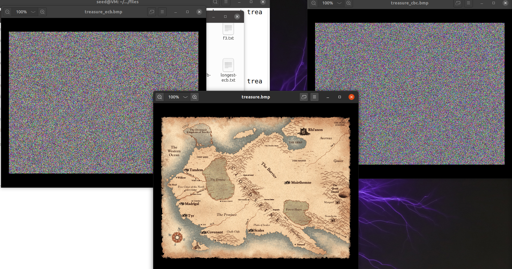

After completing this task I was quite surprised to find out that the original picture and my selected picture had different outcomes even after a couple attempts.

The ECB encryption for the original photo was not well encrypted and an outsider could piece together what was going on compared to the CBC that appears to be random noise.

While this was the case in the original picture, when doing this on my own image of a treasure map the outcome for both encryptions was only static noise for both.


#   Task 3: Padding
For block ciphers, when the size of a plaintext is not a multiple of the block size, padding may be required. The PKCS#5 padding scheme is widely used by many block ciphers. We will conduct the following experiments to understand how this type of padding works.
##   Task 3.1:
Create three files, which contain 5 bytes, 10 bytes, and 16 bytes, respectively. We can use the following command to create such files.

```
echo -n "12345" > f1.txt
```

```
echo -n "1234512345" > f2.txt
```

```
echo -n "1234512345123456" > f3.txt
```
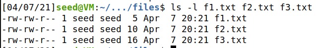


Then use ```openssl enc -aes-128-cbc -e``` to encrypt these three files using 128-bit AES with CBC mode.
```
openssl enc -aes-128-cbc -e -in f1.txt -out f1ciphercbc.txt -K
 792F423F4528482B4D6251655468576D -iv 2A472D4B6150645367566B5970337336
```

```
openssl enc -aes-128-cbc -e -in f2.txt -out f2ciphercbc.txt -K
 792F423F4528482B4D6251655468576D -iv 2A472D4B6150645367566B5970337336
```

```
openssl enc -aes-128-cbc -e -in f3.txt -out f3cipher-cbc.txt -K
 792F423F4528482B4D6251655468576D -iv 2A472D4B6150645367566B5970337336
```
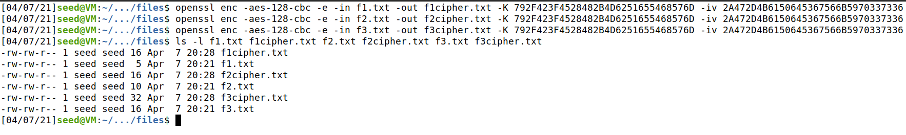
The padding on the CBC encrypted files can be seen as filling until the next 16 bytes. For the 5 and 10 byte file this is 16 bytes while for the 16 bytes the encryption added a padding of 16. This is as expected as the length of the input must be an exact multiple of the block length in bytes.

We can find out what the padding is by decrypting with the option ```-nopad```.

It appears that padding is random chars that have been placed to just fill the bytes that are necessary to complete the block.

##   Task 3.2:
Please repeat the previous task for each of the following modes of operation using the aes cipher with 128-bit keys: ECB, CFB OFB.

Please report which modes have padding and which ones do not. For those that do not need padding, please explain why.

### Task 3.2.ECB
```
openssl enc -aes-128-ecb -e -in f1.txt -out f1cipher-ecb.txt -K
 792F423F4528482B4D6251655468576D -iv 2A472D4B6150645367566B5970337336
```

```
openssl enc -aes-128-ecb -e -in f2.txt -out f2cipher-ecb.txt -K
 792F423F4528482B4D6251655468576D -iv 2A472D4B6150645367566B5970337335
```

```
openssl enc -aes-128-ecb -e -in f3.txt -out f3cipher-ecb.txt -K
 792F423F4528482B4D6251655468576D -iv 2A472D4B6150645367566B5970337333
```
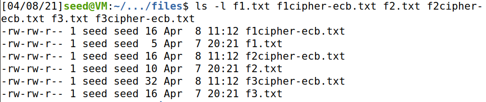
Similar findings to the above CBC is found for ECB in that a padding is add to get the file to total the next 16 bytes. This is as expected as the length of the input must be an exact multiple of the block length in bytes.

As there is padding we will decrypt and attempt to determine what this padding is as we did in task 3 ```-nopad```.

It appears that padding is random chars that have been placed to just fill the bytes that are necessary to complete the block.


### Task 3.2.CFB
```
openssl enc -aes-128-cfb -e -in f1.txt -out f1cipher-cfb.txt -K
 792F423F4528482B4D6251655468576D -iv 2A472D4B6150645367566B5970337331
```

```
openssl enc -aes-128-cfb -e -in f2.txt -out f2cipher-cfb.txt -K
 792F423F4528482B4D6251655468576D -iv 2A472D4B6150645367566B5970337334
```

```
openssl enc -aes-128-cfb -e -in f3.txt -out f3cipher-cfb.txt -K
 792F423F4528482B4D6251655468576D -iv 2A472D4B6150645367566B5970337332
```

```
ls -l f1.txt f1cipher-cfb.txt f2.txt f2cipher-cfb.txt f3.txt f3cipher-cfb.txt
```
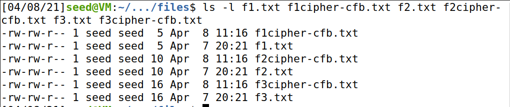
No padding is added when encrypting with CFB. This was expected as padding is not applied to CFB because CFB does not need to use all of the block cipher to create the ciphertext.


### Task 3.2.OFB
```
openssl enc -aes-128-ofb -e -in f1.txt -out f1cipher-ofb.txt -K
 792F423F4528482B4D6251655468576D -iv 2A472D4B6150645367566B5970337337
```

```
openssl enc -aes-128-ofb -e -in f2.txt -out f2cipher-ofb.txt -K
 792F423F4528482B4D6251655468576D -iv 2A472D4B6150645367566B5970337338
```

```
openssl enc -aes-128-ofb -e -in f3.txt -out f3cipher-ofb.txt -K
 792F423F4528482B4D6251655468576D -iv 2A472D4B6150645367566B5970337339
```
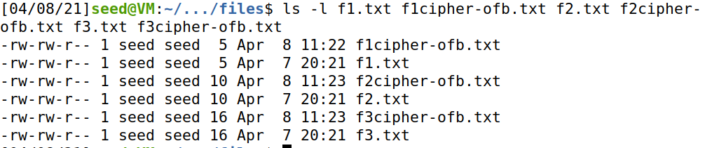
As expected from investigations into CFB no padding is added when encrypting with OFB. This is because OFB, CTR, or CFB do not need to use all of the block cipher to create the ciphertext.

#   Task 4: Error Propagation & Corrupted Ciphertext
To understand the error propagation property of various encryption modes, in this task you will create a ciphertext using a specific encryption mode, intentionally corrupt a bit in the ciphertext, decrypt the corrupted ciphertext, and then examine the result.

##   Task 4.1: Predictions
Before you actually conduct this task, please answer the following question:

How much information can you recover by decrypting the corrupted file, if the encryption mode is ECB, CBC, CFB, or OFB, respectively?

- ECB: All but 1 corrupted block

- CBC: All but 2 corrupted block

- CFB: All but 2 corrupted block

- OFB: All but 1 corrupted block
leads
The multiple block error propagation is because of the block modes dependency on the prior block, since its serves the intialization for the current encryption. ECB and OFB do not use previous blocks during encryption so only one block would be corrupted. Because of the differences in the encryption process we can predict how much the data will be damaged.

##   Task 4.2: ECB & Data Corruption
After you have answered the question in Task 5.1, please carry out the following steps:

- Create a text file that is at least 1000 bytes long.
- Encrypt the file using the AES-128 cipher.
- Intentionally corrupt the file: change a single bit in the 55th byte in the encrypted file. (You can achieve    this corruption using any hex editor.)
- Decrypt the corrupted ciphertext file using the correct key and IV.

- As seen the longest word in the english dictionary is 1965 chars and therefore when placed in a ```txt``` file the file length is larger than 1000 bytes long.


```
openssl enc -aes-128-ecb -e -in longest-word.txt -out longest-ecb.txt -K
 792F423F4528482B4D6251655468576D -iv 2A472D4B6150645367566B5970337336
```

- Corrupting the 55th byte of this file from the original C6 to C8 as seen in the screenshot
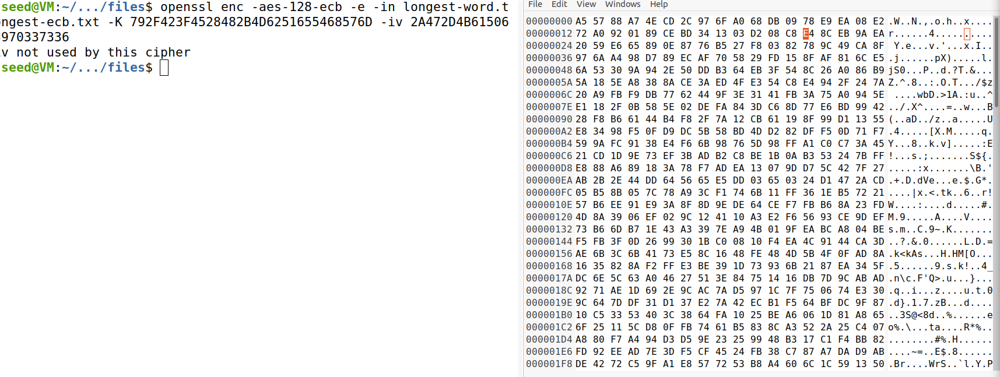

- Now that we have the corrupted file we can decrypt the file and see how the corruption affect the ECB encrypted file using the following line to decrypt.
```
openssl aes-128-ecb -d -a -in longest-ecb.txt -out longest-ecb-dec.txt -K
 792F423F4528482B4D6251655468576D -iv 2A472D4B6150645367566B5970337336
```
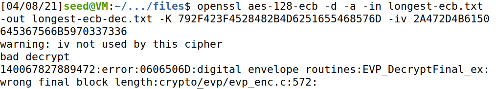


##   Task 4.3: CBC & Data Corruption
Please repeat Task 4.2, but this time use theleads CBC mode when encrypting/decrypting data.

As we already have the file we can skip to the second step and move forward with encrypting with CBC.
```
openssl enc -aes-128-cbc -e -in longest-word.txt -out longest-cbc.txt -K
 792F423F4528482B4D6251655468576D -iv 2A472D4B6150645367566B5970337336
```
- Corrupting the 55th byte of this file from the original 08 to 09 as seen in the screenshot
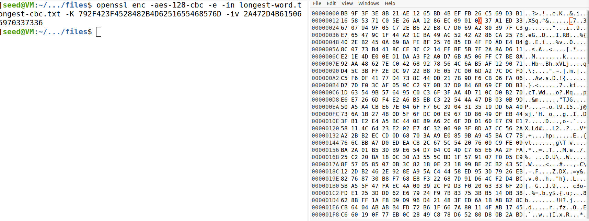

- Now that we have the corrupted file we can decrypt the file and see how the corruption affect the CBC encrypted file using the following line to decrypt.
```
openssl aes-128-ecb -d -a  -in longest-cbc.txt -out longest-cbc-dec.txt -K
 792F423F4528482B4D6251655468576D -iv 2A472D4B6150645367566B5970337336
```
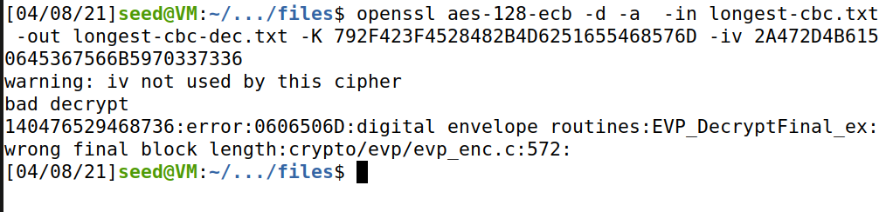

##   Task 4.4: CFB & Data Corruption
Please repeat Task 4.2, but this time use the CFB mode when encrypting/decrypting data.

As we already have the file we can skip to the second step and move forward with encrypting with CFB.
```
openssl enc -aes-128-cfb -e -in longest-word.txt -out longest-cfb.txt -K
 792F423F4528482B4D6251655468576D -iv 2A472D4B6150645367566B5970337336
```
- Corrupting the 55th byte of this file from the original E3 to E5 as seen in the screenshot


- Now that we have the corrupted file we can decrypt the file and see how the corruption affect the CFB encrypted file using the following line to decrypt.
```
openssl aes-128-cfb -d -a  -in longest-cfb.txt -out longest-cfb-dec.txt -K
 792F423F4528482B4D6251655468576D -iv 2A472D4B6150645367566B5970337336
```


##   Task 4.5: OFB & Data Corruption
Please repeat Task 4.2, but this time use the OFB mode when encrypting/decrypting data.

As we already have the file we can skip to the second step and move forward with encrypting with OFB.
```
openssl enc -aes-128-ofb -e -in longest-word.txt -out longest-ofb.txt -K
 792F423F4528482B4D6251655468576D -iv 2A472D4B6150645367566B5970337335
```
- Corrupting the 55th byte of this file from the original 90 to 99 as seen in the screenshot
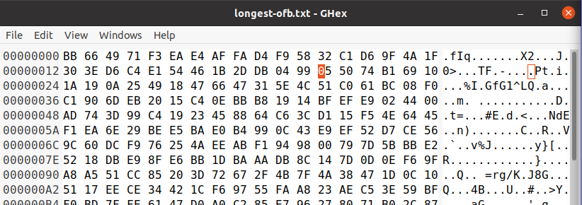

- Now that we have the corrupted file we can decrypt the file and see how the corruption affect the OFB encrypted file using the following line to decrypt.
```
openssl aes-128-ecb -d -a  -in longest-ofb.txt -out longest-ofb-dec.txt -K
 792F423F4528482B4D6251655468576D -iv 2A472D4B6150645367566B5970337335
```
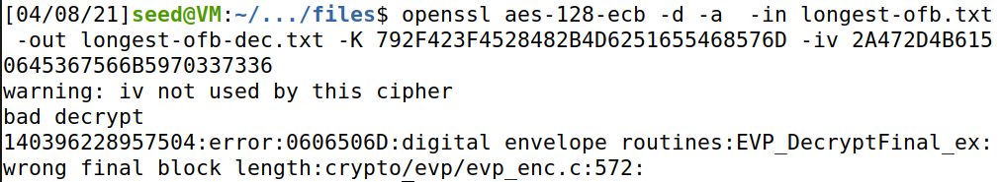

#   Task 5: Common Mistakes with IVs
Most of the encryption modes require an Initialization Vector (IV). Properties of an IV depend on the cryptographic scheme used. If we are not careful in selecting IVs, the encrypted data may not be secure, even though we are using a secure encryption algorithm and mode! The objective of this task is to help students understand some of the problems that arise if an IV is not chosen properly.

##   Task 5.1: Uniqueness of the IV
A basic requirement for the IV is uniqueness, which means that no IV may be reused under the same key. To understand why, please encrypt the same plaintext using:

- (1) two different IVs
```
openssl enc -aes-128-ofb -e -in task5.txt -out task5-dif1.txt -K
 792F423F4528482B4D6251655468576D -iv 2A472D4B6150645367566B5970337333
```
```
openssl enc -aes-128-ofb -e -in task5.txt -out task5-dif2.txt -K
 792F423F4528482B4D6251655468576D -iv 2A472D4B6150645367566B5970337331
```
- (2) the same IV.
```
openssl enc -aes-128-ofb -e -in task5.txt -out task5-same1.txt -K
 792F423F4528482B4D6251655468576D -iv 2A472D4B6150645367566B5970337335
```
```
openssl enc -aes-128-ofb -e -in task5.txt -out task5-same2.txt -K
 792F423F4528482B4D6251655468576D -iv 2A472D4B6150645367566B5970337335
```

Please describe your observations and explain why the IV needs to be unique.
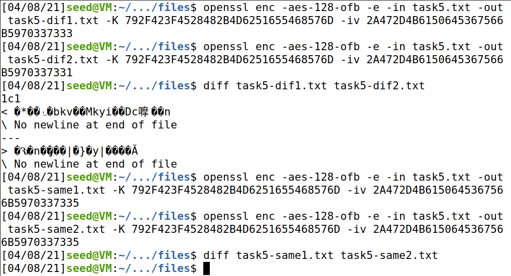

After encrypting the ```task5.txt``` for all four scenarios it can be seen above that IV selection is important especially when using the same key. As seen above when changing the IV we ended up with an encryption that was slightly different therefore would be another step to deterring someone from stealing the data. When I did not use different IVs I ended up with two identical encrypted files making the breaking of these encryption one step easier and therefore less secure.   

# Quick-Nav
- [ About this project ](#desc)
	- [ File Structure ](#struct)
- [ Task Answers ](#tasks)

\
<a name="contact"></a>
<a href= "mailto: p.oconnormsu@gmail.com?subject= Lab 06 OConnor"> Click here to send email</a>
