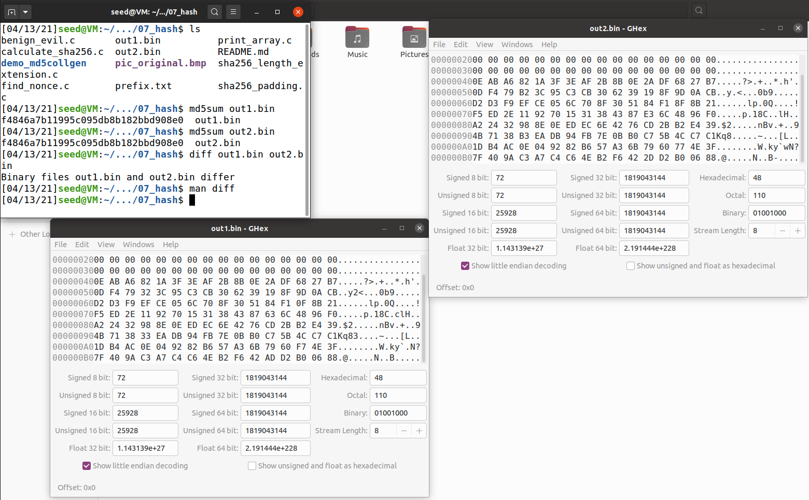
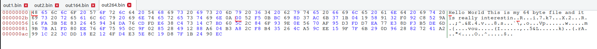
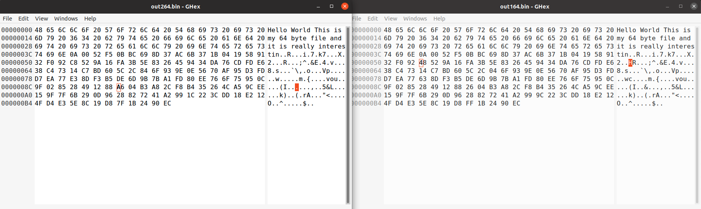
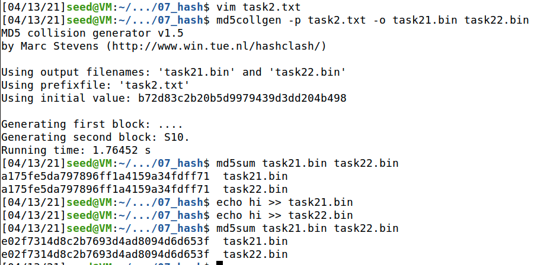
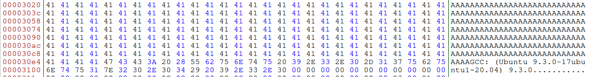
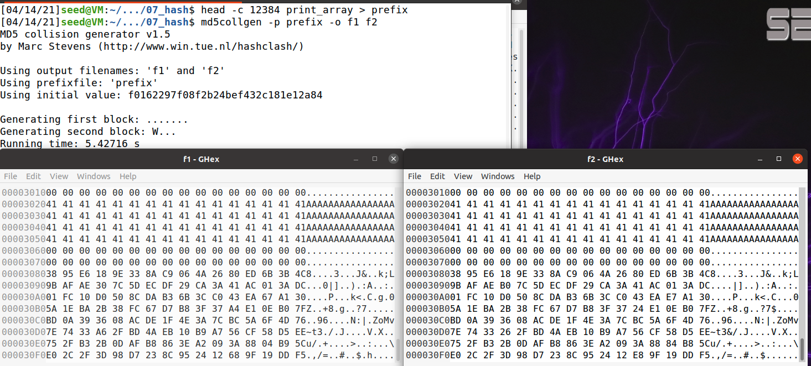
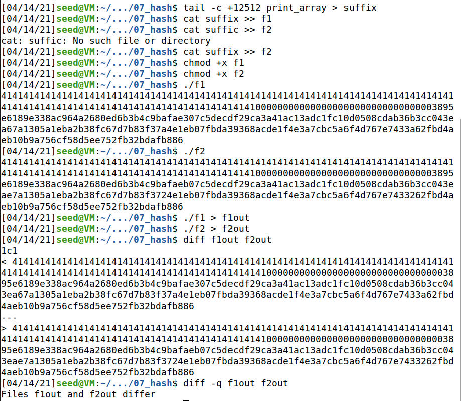
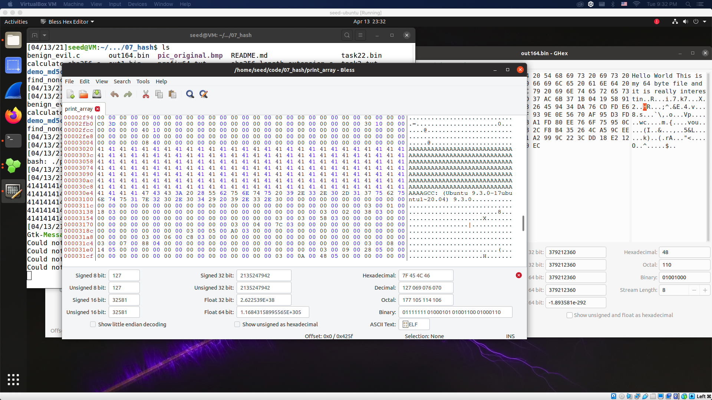
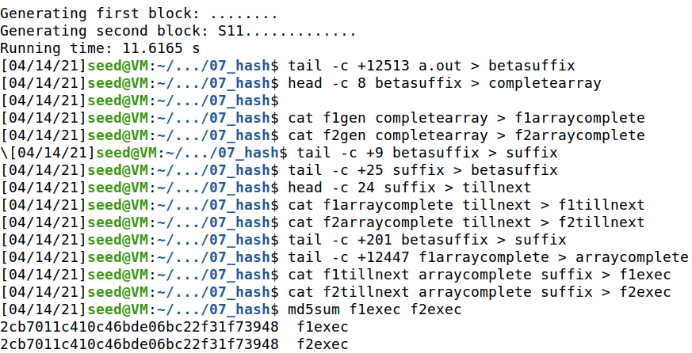
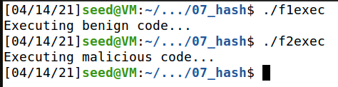

<p align="center">
    Lab 07 - MD5 Collision Attack Lab <br/>
    By Patrick O'Connor <br/>
    v75j556 <br/>
    CSCI 476 - Spring 2021 <br/>

</p>

# Table of Contents
- [ About this project ](#desc)
	- [ File Structure ](#struct)
- [ Task Answers ](#tasks)
- [Contact](#contact)
	- <a href= "mailto: p.oconnormsu@gmail.com?subject= Lab 01 OConnor"> Click here to send email</a>

<a name="desc"></a>
# About this project
The learning objective of this lab is for students to really understand the impact of collision attacks, and to see first hand what damage can be caused if a widely-used one-way hash function’s collision-resistance property is broken. To achieve this goal, students need to launch actual collision attacks against the MD5 hash function. Using the attacks, students should be able to create two different programs that share the same MD5 hash but have completely different behavior.

This lab covers the following topics:

- The one-way hash function
- The collision-resistance property
- The MD5 hash algorithm
- Collision attacks

Started: April 10, 2021
\
Last Updated: April 14, 2021
\
Due Date: April 13, 2021

<a name="struct"></a>
# File Structure
- lab07
	- README.md


<a name="tasks"></a>

#   Task 1: Generating Two Different Files with the Same MD5 Hash
In this task, we will generate two different files with the same MD5 hash values. The beginning parts of these two files need to be the same, i.e., they share the same prefix. We can achieve this using the ```md5collgen``` program, which allows us to provide a prefix file with arbitrary content.

For example, the following command generates two output files, out1.bin and out2.bin, for a given a prefix file prefix.txt:
```$ md5collgen -p prefix.txt -o out1.bin out2.bin```

We can check whether the output files are distinct or not using the ```diff``` command. We can also use the ```md5sum``` command to check the MD5 hash of each output file. For example:

```
$ diff out1.bin out2.bin
$ md5sum out1.bin
$ md5sum out2.bin
```
##  Task 1.1:
Please the ```md5collgen``` program as we have above to generate different files with the same ```md5``` hash.

Next, use a hex editor to view the two output files, and describe your observations.

While examining the two files with a hex editor it can be seen that the output of the two are quite similar but there are some differences in the output files binary. Although some differences apear the size of the zero padding is the same.



##  Task 1.2:
If the length of your prefix file is not multiple of 64, what happens? Explain.

If the prefix file is not multiple of 64, a padding of zeros is placed to fill the rest of the 64 bytes block that the MD5 processed. As seen above in the screenshot.

##  Task 1.3:
Create a prefix file with exactly 64 bytes, and run the collision tool again. What happens? (Please explain.)


After creating a file with exactly 64 bytes and rerunning the collision tool it is found that the zero padding is not there anymore. This is logical as the block size is 64 bytes although it appears the newline char has been replaced with a zero padding.  

##  Task 1.4:
Regarding the resulting collision from Task 1.3, is the data (128 bytes) generated by md5collgen completely different for the two output files? Please explain your answer and also identify any/all bytes that are different.



The data generated by ```md5collgen``` is different in a couple different positions. The bytes that were different in the two files ```out164.bin``` and ```out264.bin``` were positions 21, 61, 85. When running this multiple times, these difference do not have any observable pattern to the location of differences


#   Task 2: Understanding MD5’s “Suffix Extension” Property
In this task, we will try to better understand some of the properties of the MD5 algorithm. Namely, once we have found a hash collision for two different files, we will try to verify that we can append a common suffix and still have two different files that have the same hash. These properties are important for us to conduct further tasks in this lab.

Based on how MD5 works, we can derive the following property of the MD5 algorithm: Given two inputs M and N (M dne N), if MD5(M), i.e., the MD5 hashes of M and N are the same, then for any input T, MD5(M||T) = MD5(N||T), where ||  represents concatenation. That is, if inputs M and N have the same hash, adding the same suffix T to them will result in two outputs that have the same hash value. This property holds not only for the MD5 hash algorithm, but also for many other hash algorithms.

Your task is to design an experiment to demonstrates that this property holds for MD5.

Creating a new file name task2.txt we can then use the collision tool. After the collision tool has ran we can confirm that the md5 hashes are the same using ```md5sum task21.bin task22.bin```. It is found that they are both ```a175fe5da797896ff1a4159a34fdff71```. Using echo we can then append hi to the end of our encoded data and repeat the examination of the hashes with ```md5sum``` to find that although this has changed it is still equivalent with a value of ```e02f7314d8c2b7693d4ad8094d6d653f```. With this observation complete the investigation/experiment can be concluded as a success.   



#   Task 3: Generating Two Executable Files with the Same MD5 Hash
In this task, you are given the following C program. You need to create two different versions of this program, such that the contents of their ```xyz``` arrays are different, but the hash values of the executables are the same.
```c
#include <stdio.h>


unsigned char xyz[200] = {
    0x41, 0x41, 0x41, 0x41, 0x41, 0x41, 0x41, 0x41, 0x41, 0x41,
  0x41, 0x41, 0x41, 0x41, 0x41, 0x41, 0x41, 0x41, 0x41, 0x41,
  0x41, 0x41, 0x41, 0x41, 0x41, 0x41, 0x41, 0x41, 0x41, 0x41,
  0x41, 0x41, 0x41, 0x41, 0x41, 0x41, 0x41, 0x41, 0x41, 0x41,
  0x41, 0x41, 0x41, 0x41, 0x41, 0x41, 0x41, 0x41, 0x41, 0x41,
  0x41, 0x41, 0x41, 0x41, 0x41, 0x41, 0x41, 0x41, 0x41, 0x41,
  0x41, 0x41, 0x41, 0x41, 0x41, 0x41, 0x41, 0x41, 0x41, 0x41,
  0x41, 0x41, 0x41, 0x41, 0x41, 0x41, 0x41, 0x41, 0x41, 0x41,
  0x41, 0x41, 0x41, 0x41, 0x41, 0x41, 0x41, 0x41, 0x41, 0x41,
  0x41, 0x41, 0x41, 0x41, 0x41, 0x41, 0x41, 0x41, 0x41, 0x41,
  0x41, 0x41, 0x41, 0x41, 0x41, 0x41, 0x41, 0x41, 0x41, 0x41,
  0x41, 0x41, 0x41, 0x41, 0x41, 0x41, 0x41, 0x41, 0x41, 0x41,
  0x41, 0x41, 0x41, 0x41, 0x41, 0x41, 0x41, 0x41, 0x41, 0x41,
  0x41, 0x41, 0x41, 0x41, 0x41, 0x41, 0x41, 0x41, 0x41, 0x41,
  0x41, 0x41, 0x41, 0x41, 0x41, 0x41, 0x41, 0x41, 0x41, 0x41,
  0x41, 0x41, 0x41, 0x41, 0x41, 0x41, 0x41, 0x41, 0x41, 0x41,
  0x41, 0x41, 0x41, 0x41, 0x41, 0x41, 0x41, 0x41, 0x41, 0x41,
  0x41, 0x41, 0x41, 0x41, 0x41, 0x41, 0x41, 0x41, 0x41, 0x41,
  0x41, 0x41, 0x41, 0x41, 0x41, 0x41, 0x41, 0x41, 0x41, 0x41,
  0x41, 0x41, 0x41, 0x41, 0x41, 0x41, 0x41, 0x41, 0x41, 0x41

};

int main() {
    int i;
    for (i=0; i<200; i++){
        printf("%x", xyz[i]);
    }
    printf("\n");
}
```

After compiling and opening the executable with bless we can find the location of the array ```xyz```. This was made quite simple and as seen above, the byte offset is 3020 (12320 decimal). With this information we can now divide the whole executable into three parts as detailed in the instructions ```prefix: byte offset 0 to x```, ```change location x to y```, and ``` suffix y to end```. I ended up changing the prefix to be a little bit larger than the originally measured offset by increasing it by 64 to 12384.


Using the following sequence:
```
$ head -c 12384 print_array > prefix
$ md5collgen -p prefix -o f1 f2
```

Now we have two files ```f1``` and ```f2``` that have the same MD5 hash but different suffixes.

```
$ tail -c +12512 print_array > suffix
```

After properly finding the prefix, creating two files with the same hash, annd lastly finding the suffix which is 128 bytes after the prefix we can create the two binary files with cat.

```
$ cat f1 suffix > code1
$ cat f2 suffix > code1
```

After appending the tail we can now add executable permissions and run them. After running them we can route the output and use ```diff``` to compare this. It can be seen that although they still have the same MD5 hash they have different outputs when executed. 

#   Task 4: 
In the previous task, we successfully created two programs that have the same MD5 hash, but their behavior is only superficially different. (Their differences are only in the data they print out; they still execute the same sequence of instructions.) In this task, we would like to achieve something more interesting…

The objective of this task is to launch the attack described in the motivation above. Namely, you need to create two programs that share the same MD5 hash. However, one program will always execute benign instructions, while the other program will execute malicious instructions. In your work, what benign/malicious instructions are executed is not important; it is sufficient to demonstrate that the instructions executed by these two programs are different.

Similar to above the starting point for array is 3020 (12320 decimal) and I will use a similar approach as task 3 in that I will add a bit of cushion (12384). With this we can run ```head -c 12384 a.out > prefix``` to store the first 12384 bytes in prefix.



I will then run ```md5collgen -p prefix -o f1gen f2gen``` to generate two binaries with the same MD5 sum.

Opening with ghex we can see they differ but have the same MD5 sum that can be seen below.


```$ tail -c +12513 a.out > betasuffix```

To complete the first array in f1gen and f2gen we should concatenate the first 8 bytes of ```betasuffix``` to both ```f1arraycomplete``` and ```f2arraycomplete```. 
```
$ head -c 8 betasuffix > completearray
$ cat f1gen completearray > f1arraycomplete
$ cat f2gen completearray > f2arraycomplete
$ tail -c +9 betasuffix > suffix
```

From there I started to get the bytes between the first and second array with ```tillnext```. Adding the beginning bytes of the second array to f1arraycomplete and f2arraycomplete to create both f1tillnext and f2tillnext. 


```
$ tail -c +25 suffix > betasuffix
$ head -c 24 suffix > tillnext
$ cat f1arraycomplete tillnext > f1tillnext
$ cat f2arraycomplete tillnext > f2tillnext
```

I now had two seperate executable parts that have the contents up until the start of array . To complete this task we need to alter the second array on one exec so it does not completely match and therefore will execute the malicous print.

```
$ tail -c +201 betasuffix > suffix
$ tail -c +12447 f1arraycomplete > arraycomplete
$ cat f1tillnext arraycomplete suffix > f1exec
$ cat f2tillnext arraycomplete suffix > f2exec
```

Now that we have two files with the same MD5 hash sum we can get them to present the correct information.
```
$ md5sum f1exec f2exec
```


Now that we have ensured the MD5 hash is the same we can make them executable and run them with the following command.

```
$ chmod +x f1exec
$ chmod +x f2exec

$ ./f1exec
$ ./f2exec
```


This is extremely interesting and although MD5 is still pretty confusing to me I can see how these kind of collision can be manipulated to represent different applications while appear at the surface to be the same.


# Quick-Nav
- [ About this project ](#desc)
	- [ File Structure ](#struct)
- [ Task Answers ](#tasks)

\
<a name="contact"></a>
<a href= "mailto: p.oconnormsu@gmail.com?subject= Lab 07 OConnor"> Click here to send email</a>
