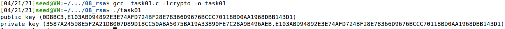
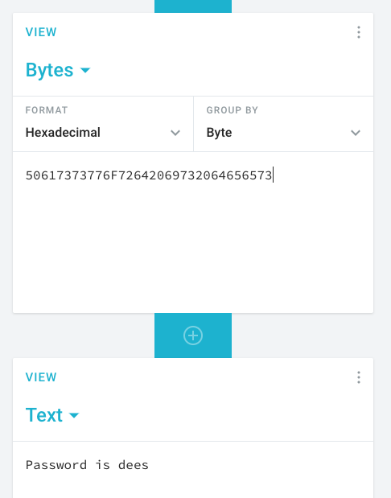

<p align="center">
    Lab 08 - RSA Public-Key Encryption and Signature Lab <br/>
    By Patrick O'Connor <br/>
    v75j556 <br/>
    CSCI 476 - Spring 2021 <br/>

</p>

# Table of Contents
- [ About this project ](#desc)
	- [ File Structure ](#struct)
- [ Task Answers ](#tasks)
- [Contact](#contact)
	- <a href= "mailto: p.oconnormsu@gmail.com?subject= Lab 08 OConnor"> Click here to send email</a>

<a name="desc"></a>
# About this project
RSA (Rivest-Shamir-Adleman) is one of the first public-key cryptosystems and is widely used for secure communication. The RSA algorithm first generates two large random prime numbers, and then uses them to generate public and private key pairs, which can be used to do encryption, decryption, digital signature generation, and digital signature verification. The RSA algorithm is built upon ideas from number theory, and it can be easily implemented with the support of libraries. The learning objective of this lab is for students to gain hands-on experience with the RSA algorithm.

This lab covers the following topics:

- Public-key cryptography
- The RSA algorithm and key generation
- Big number calculation
- Encryption and Decryption using RSA
- Digital signatures
- The X.509 certificate

Started: April 18, 2021
\
Last Updated: April 21, 2021
\
Due Date: April 20, 2021

<a name="struct"></a>
# File Structure
- lab08
	- README.md
    - images
        - 08task-1.png
        - 08task-2.png
        - 08task-3-1.png
        - 08task-3-2.png


<a name="tasks"></a>

#   Task 1: Deriving the Private Key
Let p, q, and e be three prime numbers. Let n = p * q. We will use (e,n) as the public key. Using the big number APIs, please calculate the private key .

The hexadecimal values of p, q, and e are listed below.
```
p = F7E75FDC469067FFDC4E847C51F452DF
q = E85CED54AF57E53E092113E62F436F4F
e = 0D88C3
```

Using the examples given in the lab directions I created the program below which initializes the values, assigns the hex values given above to correct variables, checks to ensure these are prime values and then prints them.

```c
#include <stdio.h>
#include <openssl/bn.h>

void printBigNum(char *msg, BIGNUM *a, BIGNUM *b){
        char *number_str_a = BN_bn2hex(a);
        char *number_str_b = BN_bn2hex(b);
        printf("%s (%s,%s)\n", msg, number_str_a, number_str_b);

        OPENSSL_free(number_str_a);
        OPENSSL_free(number_str_b);
}

int main() {
        BN_CTX *ctx          = BN_CTX_new();
        BIGNUM *p           = BN_new();
        BIGNUM *q           = BN_new();
        BIGNUM *n           = BN_new();
        BIGNUM *phi         = BN_new();
        BIGNUM *e           = BN_new();
        BIGNUM *d           = BN_new();
        BIGNUM *res         = BN_new();
        BIGNUM *p_minus1    = BN_new();
        BIGNUM *q_minus1    = BN_new();


        // Assign p,q,e
        BN_hex2bn(&p, "F7E75FDC469067FFDC4E847C51F452DF");
        BN_hex2bn(&q, "E85CED54AF57E53E092113E62F436F4F");
        BN_hex2bn(&e, "0D88C3");
        // n = p*q
        BN_mul(n,p,q,ctx);
        printBigNum("public key", e, n);

        // phi(n) = (p-1)*(q-1)
        BN_sub(p_minus1, p, BN_value_one());
        BN_sub(q_minus1, q, BN_value_one());
        BN_mul(phi, p_minus1, q_minus1, ctx);

    // check for  prime
        BN_gcd(res, phi, e, ctx);
        if (!BN_is_one(res))
        {
            printf("Error: e and phi(n) is not relatively prime \n ");
            exit(0);
        }

        BN_mod_inverse(d, e, phi, ctx);
        printBigNum("private key", d, n);


        BN_clear_free(p);
        BN_clear_free(q);
        BN_clear_free(n);
        BN_clear_free(res);
        BN_clear_free(phi);
        BN_clear_free(e);
        BN_clear_free(d);
        BN_clear_free(p_minus1);
        BN_clear_free(q_minus1);

    return 0;
}
```

With this I was able to print out the private key ```d``` through using the big number APIs. as the image below shows.


#   Task 2: Encrypting a Message
Let (e,n) be the public key. Please encrypt the message m provided below.

After you encrypt the message, you should decrypt it—we provide you with the private key, —to verify that you can recover the message.

Note: We first need to convert this ASCII string to a hex string, and then convert the hex string to a ```BIGNUM``` using the ```BN_hex2bn()``` API. You can use whatever utility is easiest for you to do this conversion (e.g., ```xxd```, ```python```). For reference, I recommend the following python commands that can be used to convert a plain ASCII string to a hex string and vice versa.
```python
# ("encode") convert ASCII to hex-encoded string
$ python -c 'print("A top secret!".encode("hex"))'
4120746f702073656372657421

# ("decode") convert hex-encoded string to ASCII
$ python -c 'print("4120746f702073656372657421".decode("hex"))'
A top secret!
```

The public key values are listed below (in hexadecimal). We also provide the private key d to help you verify your encryption result.
```
m = A top secret!
e = 010001 (this hex value equals to decimal 65537)
n = DCBFFE3E51F62E09CE7032E2677A78946A849DC4CDDE3A4D0CB81629242FB1A5
d = 74D806F9F3A62BAE331FFE3F0A68AFE35B3D2E4794148AACBC26AA381CD7D30D
```

Using a similar approach to the above task 01 I used the given information to create a program that initialized big numbers, assigned the given values, encrypted with  ```m^e mod n``` and printed the encrypted result of ```6FB078DA550B2650832661E14F4F8D2CFAEF475A0DF3A75CACDC5DE5CFC5FADC```

A screenshot can be seen below for the code used to encrypt the text ```A top secret!```.


#   Task 3: Decrypting a Message
The public/private keys used in this task are the same as the ones used in Task 2.

Please decrypt the following ciphertext C, and convert it back to a plain ASCII string.
```
C = 8C0F971DF2F3672B28811407E2DABBE1DA0FEBBBDFC7DCB67396567EA1E2493F
```

Using a similar approach to task 1 & 2, I initialized the big numbers, assigned the appropiate values, used the decryption algorithm, and clear the data. This outputted the hexidecimal value of ```50617373776F72642069732064656573``` and from there it was an easy translation to convert to ASCII with an online application. This resulted in the message of ```Password is dees```



# Quick-Nav
- [ About this project ](#desc)
	- [ File Structure ](#struct)
- [ Task Answers ](#tasks)

\
<a name="contact"></a>
<a href= "mailto: p.oconnormsu@gmail.com?subject= Lab 08 OConnor"> Click here to send email</a>


